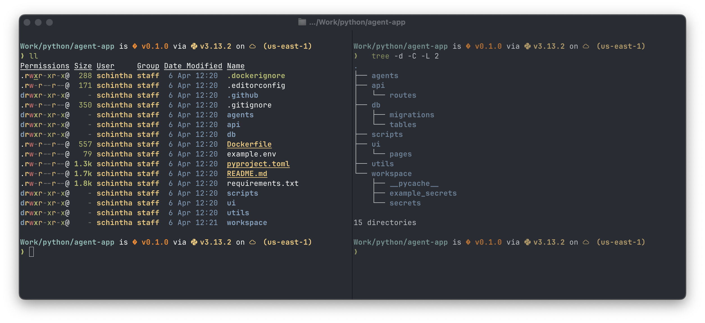

# Ghostty

[Ghostty](https://ghostty.org/docs/features) is a fast, feature-rich, and cross-platform terminal emulator that uses platform-native UI and GPU acceleration.

> [!NOTE]
> We are switching to **Ghostty** terminal from [iterm2](./iterm2.md)

The Ultimate Guide to Your Terminal Makeover
<p align="center">
  
</p>

## Prerequisites

Fonts should be installed as described in [Essentials](../essentials/essentials.md#Fonts) section.

## Install

```shell
# if you haven't already installed ghostty, run:
brew install --cask ghostty
```

## Configuration

**Zero Configuration Philosophy** - Ghostty is designed to work out of the box with no configuration for most users.

## Extensions

### Prompt

We will be using [starship](https://starship.rs) for **prompt**.

```shell
brew install starship
# after install, run:
echo 'eval "$(starship init zsh)"' >> ~/.zshrc
```

You can further [configure]((https://starship.rs/config/))  _Prompt_ by editing `~/.config/starship.toml`. We provide
_Preset [starship.toml](../../dotfiles/.config/starship.toml)_ with some cool icons and _kubecontext_ enabled.

Usage:

```shell
starship explain # Explains the currently showing modules
starship module golang # Prints a specific prompt module
starship print-config # Prints the computed starship configuration
```

### ls & ll

We will be replacing **ls** with [eza](https://eza.rocks/)  
[Features](https://the.exa.website/features/): _Colours, Grid view, Long view, Tree view, Git integration, Filtering and
Icons_  
Note: The **icon** characters must be present in the **font** you are using in your terminal

```shell
brew install eza
```

Usage:

```shell
eza --long --header --group --git
```

We also added following _alias_ to our [alias file](../../dotfiles/my/aliases.zsh), which is sourced from `~/.zshrc`

```shell
alias ls='eza  --header --group --git --long'
alias ls.tree='eza --header --group --tree --level=2  --git --long --icons'

alias ll='eza --header --group --long --all'
alias ll.tree='eza --header --group --tree --level=2  --git --long --icons --all'
```

### Shell Completions

We will be installing [zsh-completions](https://github.com/zsh-users/zsh-completions)
, [zsh-autosuggestions](https://github.com/zsh-users/zsh-autosuggestions)
and [zsh-syntax-highlighting](https://github.com/zsh-users/zsh-syntax-highlighting)

```shell
brew install zsh-completions
# To opt-in to using completions for external commands
brew completions link
# You may also need to force rebuild `zcompdump`:
rm -f ~/.zcompdump; compinit
# Additionally, if you receive "zsh compinit: insecure directories" warnings when attempting to load these completions, you may need to run this:
chmod -R go-w $(brew --prefix)/share/zsh
compaudit | xargs chmod g-w
# install zsh-autosuggestions
brew install zsh-autosuggestions
source $(brew --prefix)/share/zsh-autosuggestions/zsh-autosuggestions.zsh
# install zsh-syntax-highlighting
brew install zsh-syntax-highlighting
source $(brew --prefix)/share/zsh-syntax-highlighting/zsh-syntax-highlighting.zsh
```

Search previous used commands using **Arrows**

| Arrows  | Result                    |
|---------|---------------------------|
| ↑ ↓     | History Search            |
| ^ i     | Completion Search         |
| ⌥ + ← → | Jump Word                 |
| ⌘ + ← → | Jump line beginning / end |

Add following to `~/.zshrc`

> Search Previous Used Commands using arrows. [up and down arrows - history search](https://unix.stackexchange.com/questions/97843/how-can-i-search-history-with-text-already-entered-at-the-prompt-in-zsh)

```shell
autoload -U history-search-end
zle -N history-beginning-search-backward-end history-search-end
zle -N history-beginning-search-forward-end history-search-end
bindkey "^[[A" history-beginning-search-backward-end
bindkey "^[[B" history-beginning-search-forward-end
```

## Reference

- Configuration [Docs](https://ghostty.org/docs/config)
