# iTerm2

[iTerm2](https://iterm2.com) is an open source replacement for Apple's Terminal. It's highly customizable and comes with
a lot of useful features.

The Ultimate Guide to Your Terminal Makeover
<p align="center">
  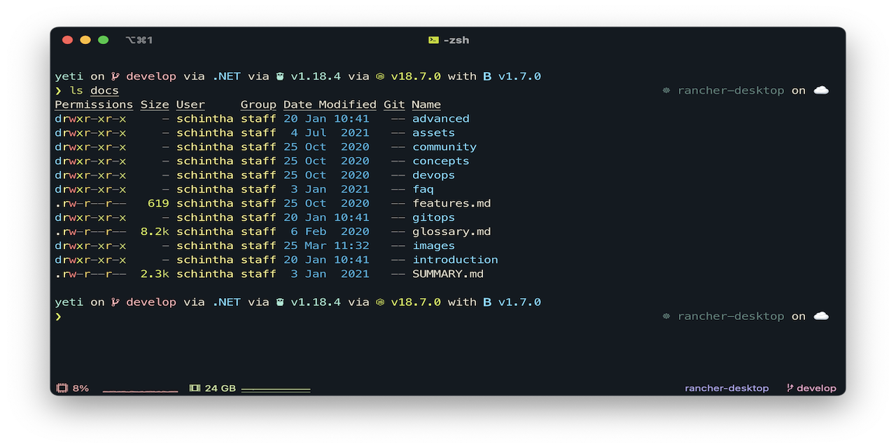
</p>

## Prerequisites

Fonts should be installed as described in [Essentials](../essentials/essentials.md#Fonts) section.

## Install

```shell
# if you haven't already installed iterm2, run:
brew install --cask --appdir=~/Applications iterm2
```

## Customization

From iTerm2 Menu, select:

1. Make iTerm2 Default Term
2. Install Shell Integration - Select `Download and Run Installer`
    1. Or, run `curl -L https://iterm2.com/shell_integration/install_shell_integration_and_utilities.sh | zsh`

### Appearance

Follow the screenshots and apply settings as shown:

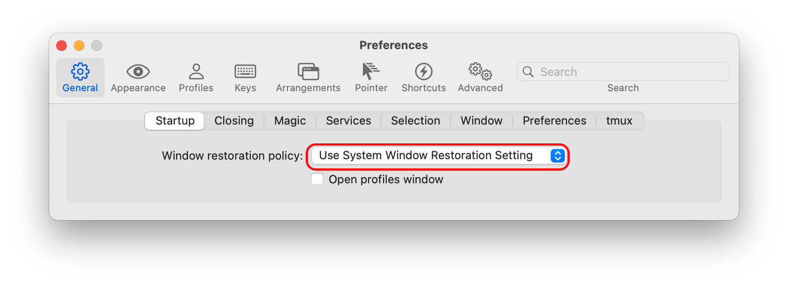

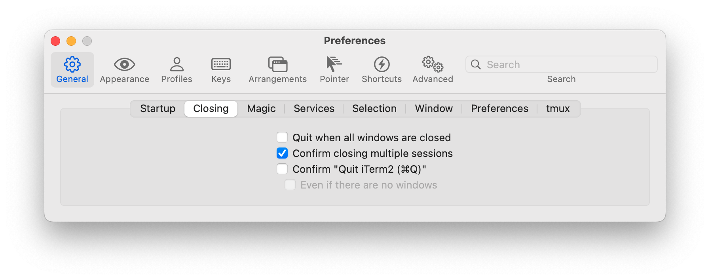

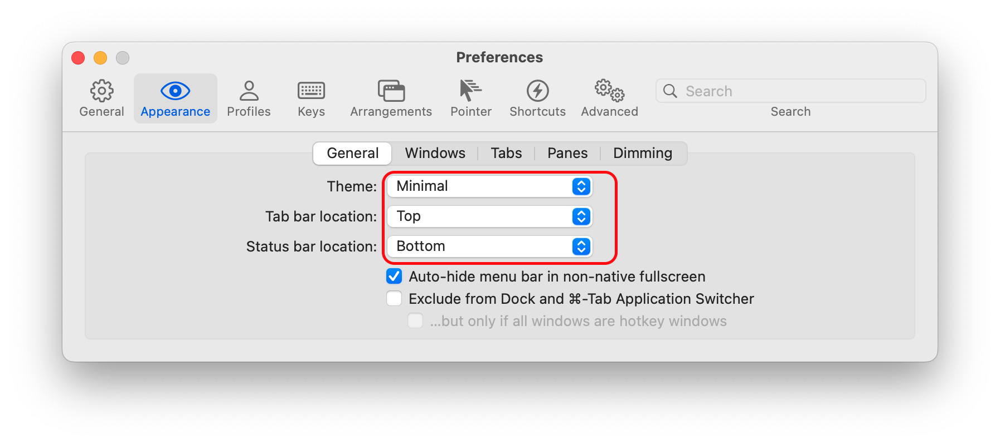

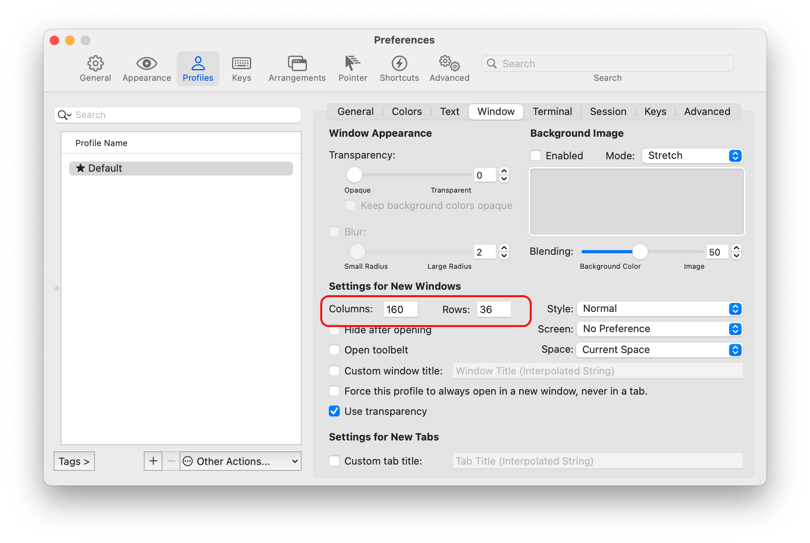

Go into Preferences and uncheck the indicators: `Profiles > Terminal > Show mark indicators`.
It will conflict with our _starship_ prompt.


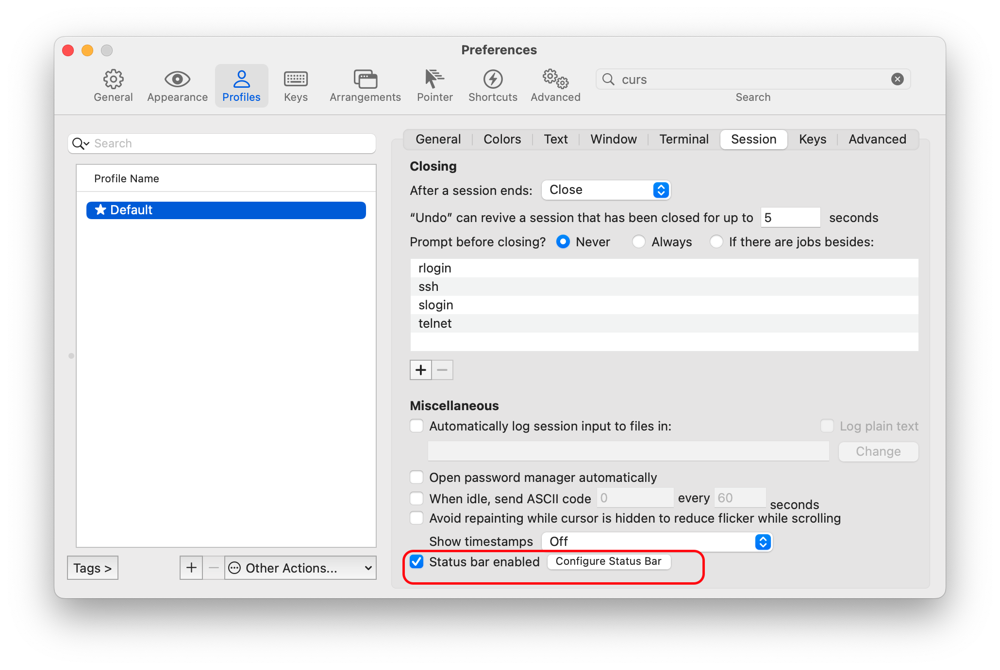

Click `Configure Status Bar` button, and then `Advanced` button<br/>
enable iterm2 Session [Restoration](https://iterm2.com/documentation-restoration.html)

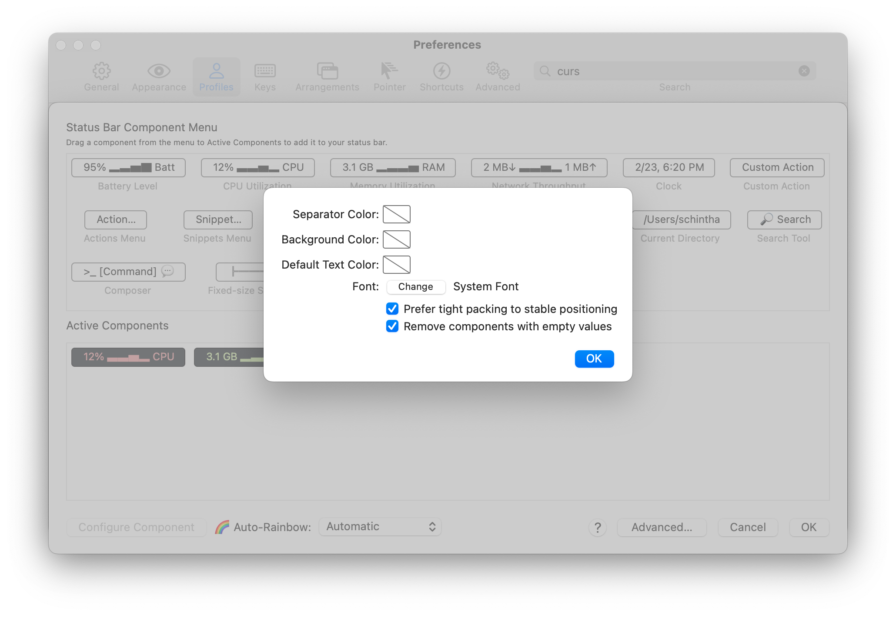

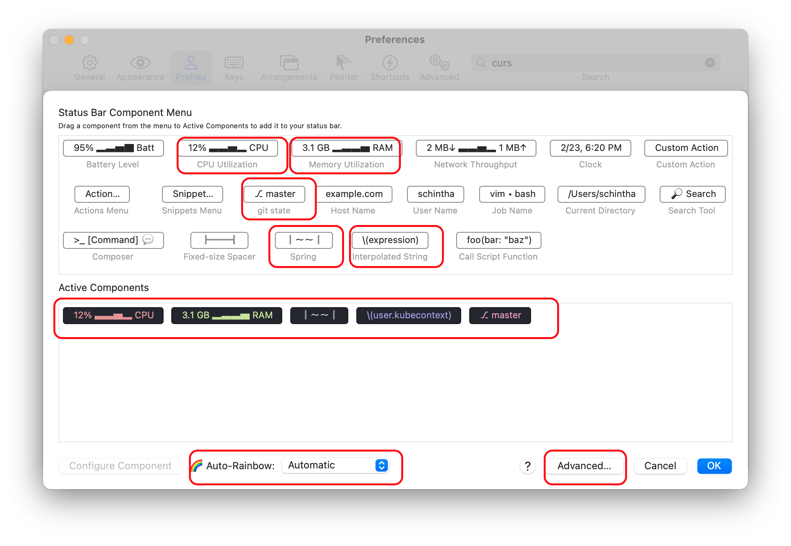

Add _kubecontext_ Status Bar component

- iTerm2 > Preferences > Profiles > Session > Configure Status Bar
- Drag a new Interpolated String component to Active Components.
- Select the new component and click Configure Component.
- Set String Value to `\(user.kubecontext)`

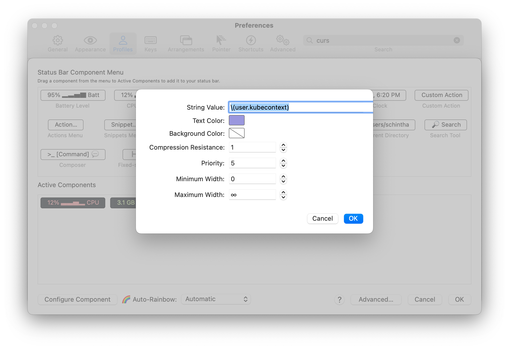

## Shortcut Keys

Under _Preferences → Profile → ("Default") → Keys → Key Mappings:_<br/>
Click the `Presets` dropdown and select `Natural Text Editing`.
When prompted: `Load Preset` click `Remove` button.

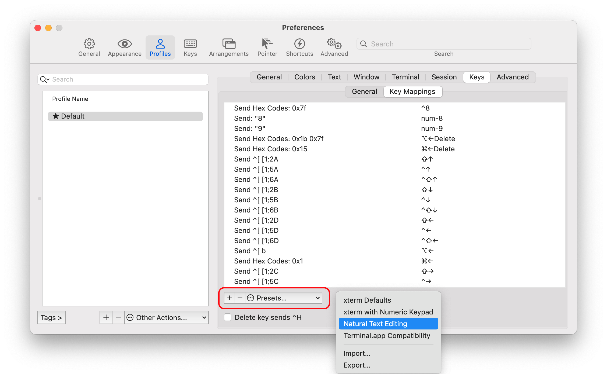

### Colors and Fonts

Under  _Preference → Profile → Default → Colors → Color Presets:_<br/>
**Install Color Preset:**
Download  [Clovis-iTerm2-Color-Scheme](../../apps/iterm2/colors/Clovis-iTerm2-Color-Scheme.itermcolors)
or [one-dark](../../apps/iterm2/colors/one-dark.itermcolors) file to `~/Downloads` folder,
import the `.itermcolors` file, then select the `Clovis-iTerm2-Color-Scheme`  preset you just installed.

> you have to rename `~/Downloads/Clovis-iTerm2-Color-Scheme.txt` file to `~/Downloads/Clovis-iTerm2-Color-Scheme.itermcolors.itermcolors` before importing.

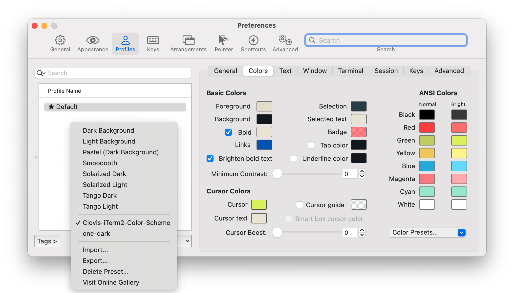

#### Note

> Some iTerm2 users have reported [not being able to see the suggestions](https://github.com/zsh-users/zsh-autosuggestions/issues/416#issuecomment-486516333)
> If this affects you, the problem is likely caused by incorrect color settings for **_Dark Theme_**.
> In order to correct this, go into iTerm2's setting, navigate to  _Preference → Profile → Default → Colors_, and make sure that the colors for `Basic Colors → Background` and `ANSI Colors → Black: Bright`  are different.

From _Preference → Profile → Default → Colors_, Adjust `Black Bright` under `ANSI colors`:

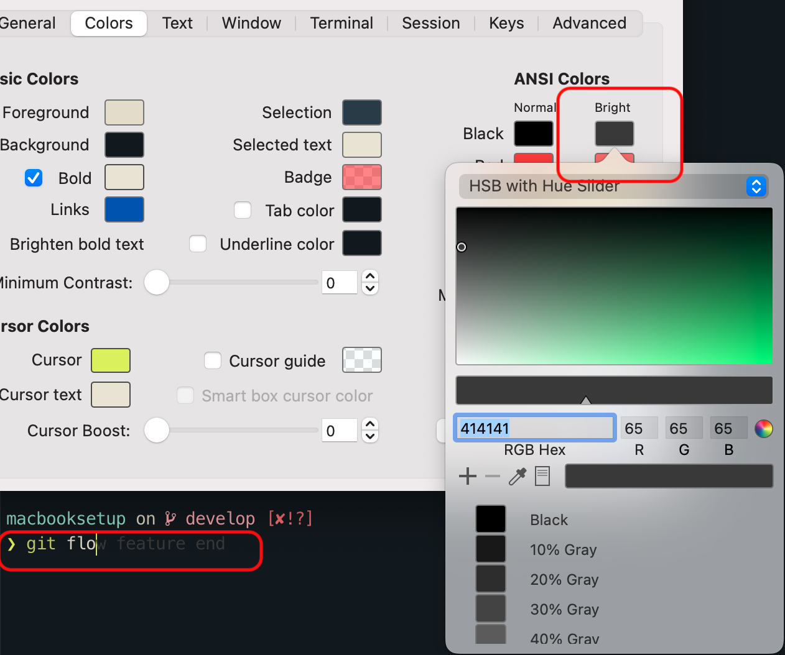

Under  _Preference → Profile → Default → Text:_<br/>
Select Font: `Meslo LGM Nerd Font Mono`, `FiraCode Nerd Font Mono`  Or  `Hack Nerd Font Mono` and Check `Use ligatures`

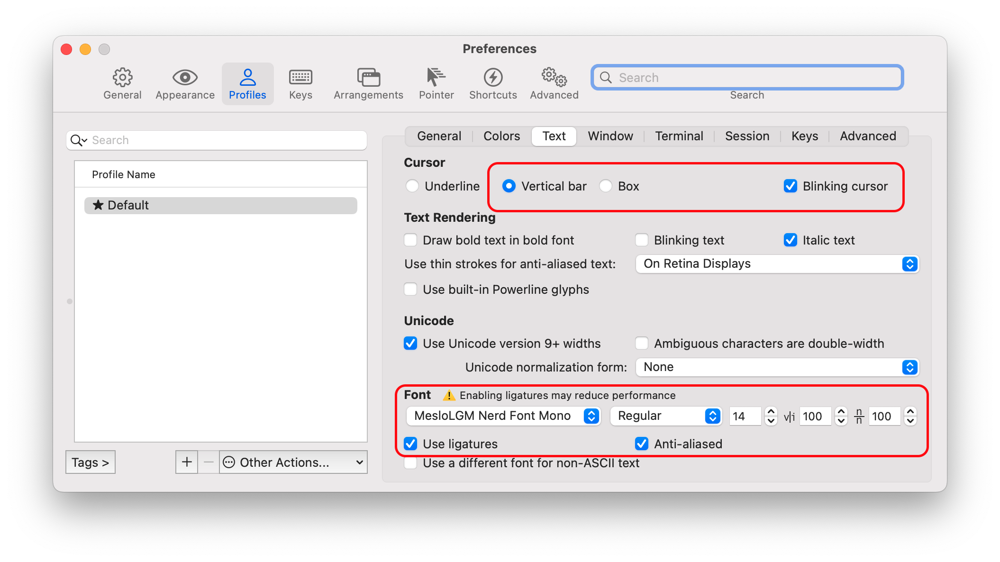

### Working Directory

Under  _Preferences → Profiles → General → Working Directory → Advanced Configuration_, set:

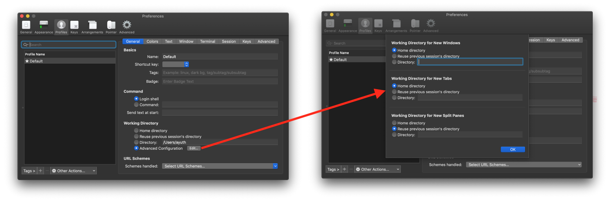

## Extensions

### Prompt

We will be using [starship](https://starship.rs) for **prompt**.

```shell
brew install starship
# after install, run:
echo 'eval "$(starship init zsh)"' >> ~/.zshrc
```

You can further [configure]((https://starship.rs/config/))  _Prompt_ by editing `~/.config/starship.toml`. We provide
_Preset [starship.toml](../../dotfiles/.config/starship.toml)_ with some cool icons and _kubecontext_ enabled.

Usage:

```shell
starship explain # Explains the currently showing modules
starship module golang # Prints a specific prompt module
starship print-config # Prints the computed starship configuration
```

### ls & ll

We will be replacing **ls** with [eza](https://eza.rocks/)  
[Features](https://the.exa.website/features/): _Colours, Grid view, Long view, Tree view, Git integration, Filtering and
Icons_  
Note: The **icon** characters must be present in the **font** you are using in your terminal

```shell
brew install eza
```

Usage:

```shell
eza --long --header --group --git
```

We also added following _alias_ to our [alias file](../../dotfiles/my/aliases.zsh), which is sourced from `~/.zshrc`

```shell
alias ls='eza  --header --group --git --long'
alias ls.tree='eza --header --group --tree --level=2  --git --long --icons'

alias ll='eza --header --group --long --all'
alias ll.tree='eza --header --group --tree --level=2  --git --long --icons --all'
```

### Shell Completions

We will be installing [zsh-completions](https://github.com/zsh-users/zsh-completions)
, [zsh-autosuggestions](https://github.com/zsh-users/zsh-autosuggestions)
and [zsh-syntax-highlighting](https://github.com/zsh-users/zsh-syntax-highlighting)

```shell
brew install zsh-completions
# To opt-in to using completions for external commands
brew completions link
# You may also need to force rebuild `zcompdump`:
rm -f ~/.zcompdump; compinit
# Additionally, if you receive "zsh compinit: insecure directories" warnings when attempting to load these completions, you may need to run this:
chmod -R go-w $(brew --prefix)/share/zsh
compaudit | xargs chmod g-w
# install zsh-autosuggestions
brew install zsh-autosuggestions
source $(brew --prefix)/share/zsh-autosuggestions/zsh-autosuggestions.zsh
# install zsh-syntax-highlighting
brew install zsh-syntax-highlighting
source $(brew --prefix)/share/zsh-syntax-highlighting/zsh-syntax-highlighting.zsh
```

Search previous used commands using **Arrows**

| Arrows  | Result                    |
|---------|---------------------------|
| ↑ ↓     | History Search            |
| ^ i     | Completion Search         |
| ⌥ + ← → | Jump Word                 |
| ⌘ + ← → | Jump line beginning / end |

Add following to `~/.zshrc`

> Search Previous Used Commands using arrows. [up and down arrows - history search](https://unix.stackexchange.com/questions/97843/how-can-i-search-history-with-text-already-entered-at-the-prompt-in-zsh)

```shell
autoload -U history-search-end
zle -N history-beginning-search-backward-end history-search-end
zle -N history-beginning-search-forward-end history-search-end
bindkey "^[[A" history-beginning-search-backward-end
bindkey "^[[B" history-beginning-search-forward-end
```

## iTerm2 More

### iTerm2 setup for day-to-day use

> in iTerm2

1. split screen horizontally
2. go to the bottom screen and split it vertically

I was using top screen for the work with yaml files and kubectl.

Left bottom screen was running:

> watch kubectl get pods

Right bottom screen was running:

> watch "kubectl get events --sort-by='{.lastTimestamp}' | tail -6"

With such setup it was easy to observe in real time how my pods are being created.

## Hints

- Order of shell expectation  `~/.zprofile` then `~/.zshrc`
