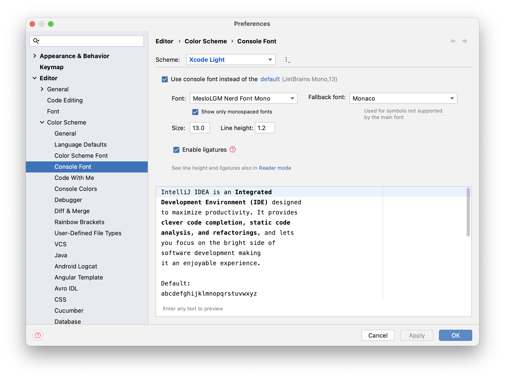
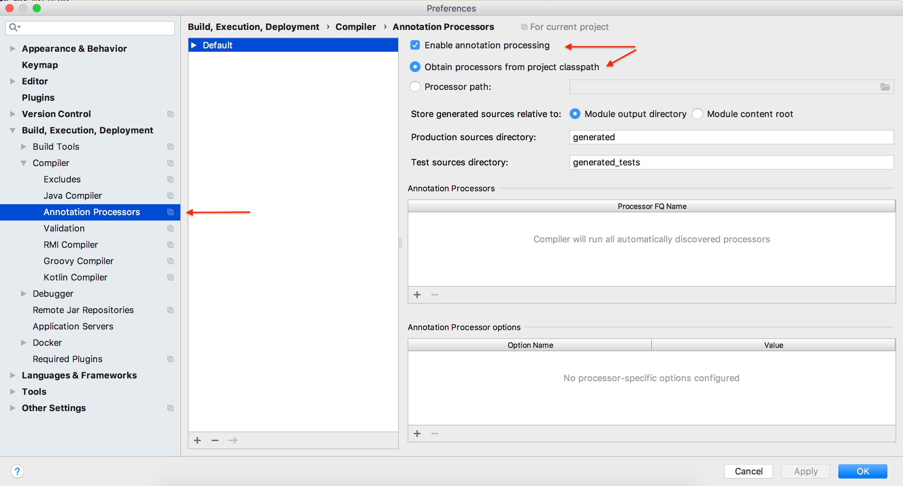

# JetBrains

## Prerequisites

Install **JDK** via **SDKMan** per [instructions](../platforms/java/java.md).

## Install

[JetBrains Toolbox](https://www.jetbrains.com/toolbox-app/) added (🧊)icon to _menu-bar_. From _Toolbox_, you can
install:

1. IntelliJ IDEA - _Java/Kotlin IDE_
2. Goland - _Go language IDE_
3. WebStorm - _Node/UX IDE_
4. CLion - _Rust/C/C++ IDE_
5. PyCharm - _Python IDE_

You can also install Jetbrains _Early Access Program_ [(EAP)](https://www.jetbrains.com/resources/eap/) software from this **Toolbox** to try _beta_ features.

## Customizations

### Local Changes

If you prefer _Commit_ panel as tab in _git_ panel, you can change via: 
You may Uncheck **Use non-modal commit interface** option in `Preferences | Version Control | Commit.`

|                                          Before                                           |                                          After                                          |
|:-----------------------------------------------------------------------------------------:|:---------------------------------------------------------------------------------------:|
|  |  |
|                   IntelliJ IDEA - version control local changes hidden                    |                 IntelliJ IDEA - version control local changes revealed                  |

### Mermaid

- Go to `Preferences | Languages & Frameworks | Markdown` install and check `Mermaid` Markdown extensions

### Fonts

Try one of the below fonts for `Editor` and pick what you like. `Preferences --> Editor --> Font`

1. JetBrain Mono with Ligatures Enabled
2. Monaco with Ligatures Enabled

Change fonts for embedded terminal to `MesloLGM Nerd Font Mono` at `Preferences  -> Editor -> Color Scheme -> Console Font`.

### Enabling Annotation Processing

**Lombok** uses annotation processing through APT. So, when the compiler calls it, the library generates new source files based on annotations in the originals.

**Annotation processing isn't enabled by default, though.**

Therefore, the first thing to do is to enable annotation processing in our project.

We need to go to the `Preferences | Build, Execution, Deployment | Compiler | Annotation Processors` and make sure of the following:

1. `Enable annotation processing box` is checked
2. `Obtain processors from project classpath` option is selected

### For All (IntelliJ, GoLand, WebStorm ...)

#### Recommended Plugins

Recommended Plugins for all JetBrains products

1. [Xcode Theme](https://plugins.jetbrains.com/plugin/15727-xcode-theme)
    1. Choose either **Xcode** **Light** or **Dark** theme from `Preferences --> Appearance & Behavior --> Appearance`
2. [Atom Material Icons](https://plugins.jetbrains.com/plugin/10044-atom-material-icons)
3. [Rainbow Brackets](https://plugins.jetbrains.com/plugin/10080-rainbow-brackets)
4. [GitHub Copilot](https://plugins.jetbrains.com/plugin/17718-github-copilot)
    1. [Getting Started with GitHub Copilot in JetBrains](https://github.com/github/copilot-docs/blob/main/docs/jetbrains/gettingstarted.md#getting-started-with-github-copilot-in-jetbrains)
5. [Diagrams - drawio](https://plugins.jetbrains.com/plugin/15635-diagrams-net-integration)

### IntelliJ IDEA

#### Recommended Plugins

Install following plugins from `Preferences --> Plugins`

1. [kotest](https://plugins.jetbrains.com/plugin/14080-kotest)
2. [Kotlin Fill Class](https://plugins.jetbrains.com/plugin/10942-kotlin-fill-class)
3. [Pieces](https://plugins.jetbrains.com/plugin/17328-pieces)
4. [CodeMR](https://plugins.jetbrains.com/plugin/10811-codemr)

### Goland

#### Recommended Plugins

Install following plugins from `Preferences --> Plugins`

1. [Protocol Buffer Editor plugin](https://plugins.jetbrains.com/plugin/14004-protocol-buffers/)
2. [Terraform and HCL](https://plugins.jetbrains.com/plugin/7808-terraform-and-hcl/)

### WebStorm

#### Recommended Plugins

Install following plugins from `Preferences --> Plugins`

1. [Svelte](https://plugins.jetbrains.com/plugin/12375-svelte)
2. [Vitest Runner](https://plugins.jetbrains.com/plugin/19220-vitest-runner)
3. [.env files support](https://plugins.jetbrains.com/plugin/9525--env-files-support)
4. [Protocol Buffers](https://plugins.jetbrains.com/plugin/14004-protocol-buffers)
5. [Toml](https://plugins.jetbrains.com/plugin/8195-toml)

## Tips

JetBrains' [Markdown Syntax](https://www.jetbrains.com/help/hub/Markdown-Syntax.html#quick-notes-markdown-links)
