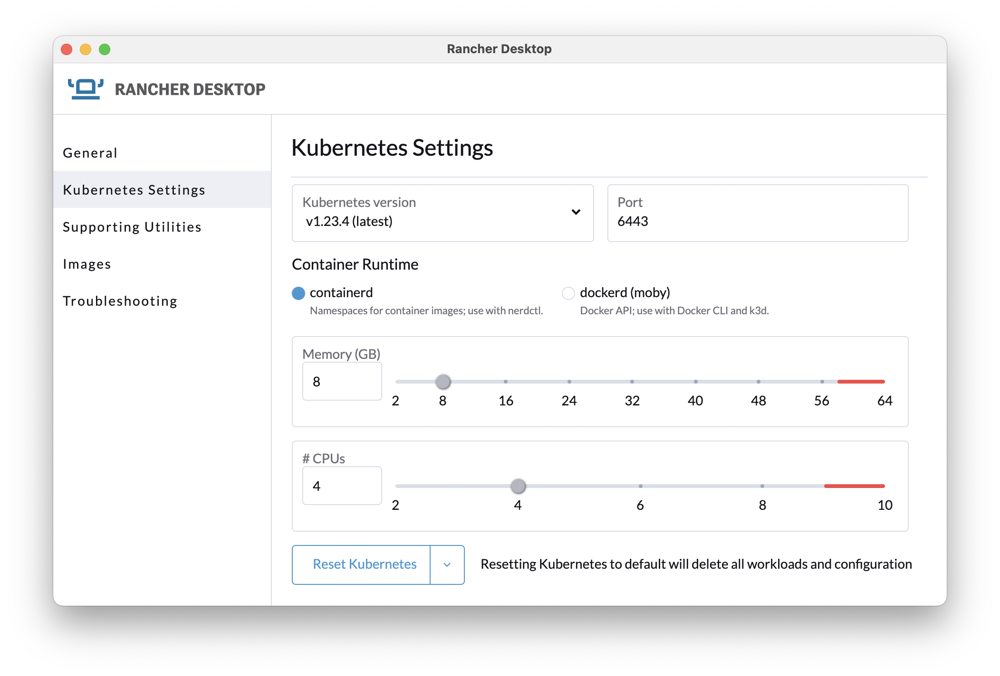
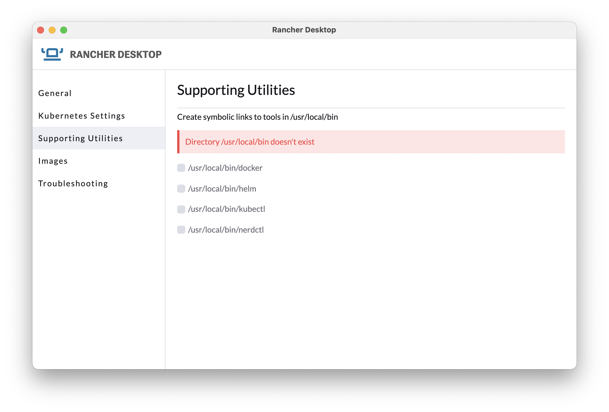

# Rancher Desktop

Provides **Docker**, **Kubernetes** runtime and CLI **tools** for local development.

**[Rancher Desktop](https://rancherdesktop.io)** Kubernetes and Container Management on the Desktop. Is the replacement for **Docker for Mac**

Download and install the latest binary for your platform from [rancherdesktop.io](https://rancherdesktop.io/).
Unpack and move `Rancher Desktop.app` to `/Applications`<br/>
_e.g., Rancher.Desktop-x.y.z.aarch64.dmg for Mac M1_

It includes:

1. [lima](https://github.com/lima-vm/lima)
2. [containerD](https://containerd.io)
3. [k3s](https://k3s.io/)
4. [traefik](https://traefik.io/)


After _Rancher Desktop_ is installed, users will have access to these supporting utilities:

- [Helm](https://helm.sh/)
- [kubectl](https://kubernetes.io/docs/reference/kubectl/overview/)
- [nerdctl](https://github.com/containerd/nerdctl)
- **rdctl** - Do all action you can do at _Rancher Desktop_ UI via command line
    ```shell
    rdctl list-settings
    rdctl set --container-runtime dockerd --kubernetes-version 1.23.4
    rdctl shutdown
    ```

## Configuration

It is recommended assign:
* 8 GB of memory
* 4 CPU
* Enable **Traefik**




##  DevOps tools

Install optional DevOps tools for SREs
```shell
brew install kubectx # to switch kube context, namespace quickly. https://github.com/ahmetb/kubectx 
brew install kubens # to switch kube  quickly 
brew install kubernetes-helm # package manager for Kubernetes
brew install kustomize # Kubernetes native configuration management
brew install stefanprodan/tap/kustomizer # package manager for distributing Kubernetes configuration as OCI artifacts
brew install derailed/k9s/k9s # Manage Your k8s In Style!
brew install istioctl # Istio configuration command line utility 
brew install dive # A tool for exploring a docker image, layer contents, and discovering ways to shrink the size of your Docker/OCI image
brew install crane # A tool for interacting with remote images and registries.
brew install cosign # Container Signing, Verification and Storage in an OCI registry. 
brew install skaffold # build and deploy docker images
go install sigs.k8s.io/bom/cmd/bom@latest # Create SPDX-compliant Bill of Materials
```

**nerdctl** runs inside the lima VM, so the **cosign** binary has to be installed inside the VM as well.<br/>
Install **cosign** with following script as workaround for [issue](https://github.com/rancher-sandbox/rancher-desktop/issues/1905)

```shell
LIMA_HOME="$HOME/Library/Application Support/rancher-desktop/lima" \
"/Applications/Rancher Desktop.app/Contents/Resources/resources/darwin/lima/bin/limactl" shell 0 sudo apk add cosign \
--repository=http://dl-cdn.alpinelinux.org/alpine/edge/community
```

## Usage

```shell
nerdctl info 
nerdctl version
nerdctl stats
nerdctl top CONTAINER
nerdctl volume ls
nerdctl network ls
```

### Namespace management

```shell
nerdctl namespace ls
```

### Images

```shell
nerdctl build .
nerdctl tag
nerdctl tag SOURCE_IMAGE[:TAG] TARGET_IMAGE[:TAG]

nerdctl images
nerdctl -n k8s.io images

nerdctl login -u aaaa -p bbb
# Log in to your repository, I am using GitHub container registry
export GITHUB_PACKAGES_TOKEN=ghp_YOUR_TOKEN
echo $GITHUB_PACKAGES_TOKEN | nerdctl login ghcr.io -u xmlking --password-stdin
# docker login -u {github_username} -p {[token](https://github.com/settings/tokens)} ghcr.io

# inspect image 
nerdctl image inspect redislabs/redismod:edge

# Remove one or more images
nerdctl -n k8s.io rmi docker.vectorized.io/vectorized/redpanda:v21.11.2

# default from docker.io
nerdctl -n k8s.io pull jwsy/jade-shooter:v1.1

nerdctl -n k8s.io images | grep jwsy
nerdctl -n k8s.io run -d -p 8080:80 jwsy/jade-shooter:v1.1
nerdctl -n k8s.io run -d -p 80:80 --name=nginx --restart=always nginx

# `e2a5` is output from above command
nerdctl -n k8s.io exec -it e2a5 sh
nerdctl -n k8s.io images
# save load  
nerdctl -n k8s.io save -o local_jwsy_jade-shooter_v1.2.tar
nerdctl -n k8s.io load -i local_jwsy_jade-shooter_v1.2.tar
```

#### Encrypt image layers with [ocicrypt](https://github.com/containerd/nerdctl/blob/master/docs/ocicrypt.md).

```shell
openssl genrsa -out mykey.pem
openssl rsa -in mykey.pem -pubout -out mypubkey.pem
nerdctl image encrypt --recipient=jwe:mypubkey.pem --platform=linux/amd64,linux/arm64 foo example.com/foo:encrypted
nerdctl push example.com/foo:encrypted
```

#### Sign and Verify Container Image with [cosign](https://github.com/containerd/nerdctl/blob/master/docs/cosign.md) tool
```shell
# Generate a key-pair: cosign.key and cosign.pub
cosign generate-key-pair

# Export your COSIGN_PASSWORD to prevent CLI prompting
export COSIGN_PASSWORD=$COSIGN_PASSWORD
```
Sign the container image while pushing:
```shell
# Sign the image with Keyless mode
nerdctl push --sign=cosign devopps/hello-world

# Sign the image and store the signature in the registry
nerdctl push --sign=cosign --cosign-key cosign.key devopps/hello-world
```
Verify the container image while pulling:
```shell
# Verify the image with Keyless mode
nerdctl pull --verify=cosign devopps/hello-world
```

_Currently, above integrated command: `nerdctl push --sign=cosign`  [don't work](https://github.com/rancher-sandbox/rancher-desktop/issues/1905). workaround:_ 
```shell
# push first 
nerdctl push -ghcr.io/xmlking/grpc-starter-kit/base:v0.2.0
# then sigh and verify
COSIGN_EXPERIMENTAL=1 cosign sign ghcr.io/xmlking/grpc-starter-kit/base:v0.2.0
COSIGN_EXPERIMENTAL=1 cosign verify ghcr.io/xmlking/grpc-starter-kit/base:v0.2.0
```

#### Generate and upload the SBOM

We will use the **syft** to generate the SBOM and once its generated we will attach to image using **cosign**
```shell
# Let’s first generate the SBOM
syft packages ghcr.io/junaid18183/sampleapp:0.0.1 -o spdx  > latest.spdx
cosign attach sbom --sbom latest.spdx ghcr.io/xmlking/sampleapp:0.0.1
```

### Dive
To explore docker image layers:

```bash
dive spring-service:1.6.5-SNAPSHOT
```

### Compose

```shell
nerdctl compose -f infra/redis.yml up redis
nerdctl compose -f infra/redpanda.yml up redpanda
nerdctl compose -f infra/redpanda.yml logs
nerdctl compose -f infra/redis.yml down
nerdctl compose -f infra/redpanda.yml down
# this will stop redpanda and remove all volumes
nerdctl compose -f infra/redpanda.yml down -v 

nerdctl compose -f infra/redpanda.yml ps
# name of the container can be found from output of above command 
nerdctl exec -it infra_redpanda_1 /bin/bash
nerdctl exec -it infra_redpanda_1 rpk version
nerdctl exec -it infra_redpanda_1 rpk topic list
nerdctl exec -it infra_redpanda_1 rpk cluster info


nerdctl exec -it redpanda-1 \
rpk topic produce twitch_chat --brokers=localhost:9092
nerdctl exec -it redpanda-1 \
rpk topic consume twitch_chat --brokers=localhost:9092
```

### traefik

How to expose **traefik** v2 dashboard?

create `dashboard.yaml` file

```shell
cat << 'EOF' > dashboard.yaml
apiVersion: traefik.containo.us/v1alpha1
kind: IngressRoute
metadata:
  name: dashboard
spec:
  entryPoints:
    - web
  routes:
    - match: Host(`traefik.localhost`) && (PathPrefix(`/dashboard`) || PathPrefix(`/api`))
      kind: Rule
      services:
        - name: api@internal
          kind: TraefikService
EOF
```

```shell
kubectl -n kube-system apply -f dashboard.yaml
```

open dashboard in your favorite browser and **don't forget the second slash**

```shell
open http://traefik.localhost/dashboard/#/
```

## Reference 

- StevenACoffman's [Docker Best Practices and Antipatterns](https://gist.github.com/StevenACoffman/41fee08e8782b411a4a26b9700ad7af5) 
- [Signing images and creating SBOM using cosign](https://www.ijuned.com/Signing-images-and-creating-SBOM-using-cosign/)
- A collection of useful things you can do with `crane` is [here](https://github.com/google/go-containerregistry/blob/main/cmd/crane/recipes.md)
- [Compendium of Kubernetes Application Deployment Tools](https://medium.com/@KarlKFI/compendium-of-kubernetes-application-deployment-tools-80a828c91e8f)