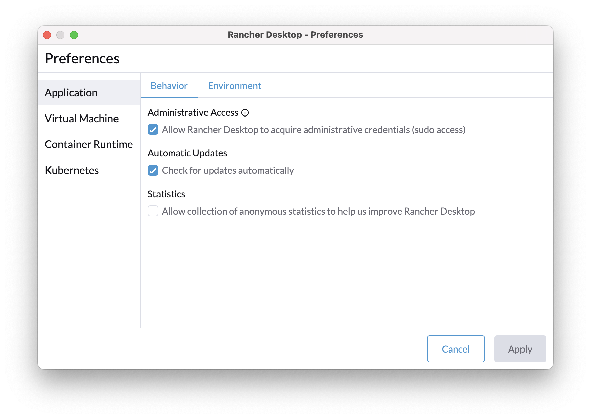
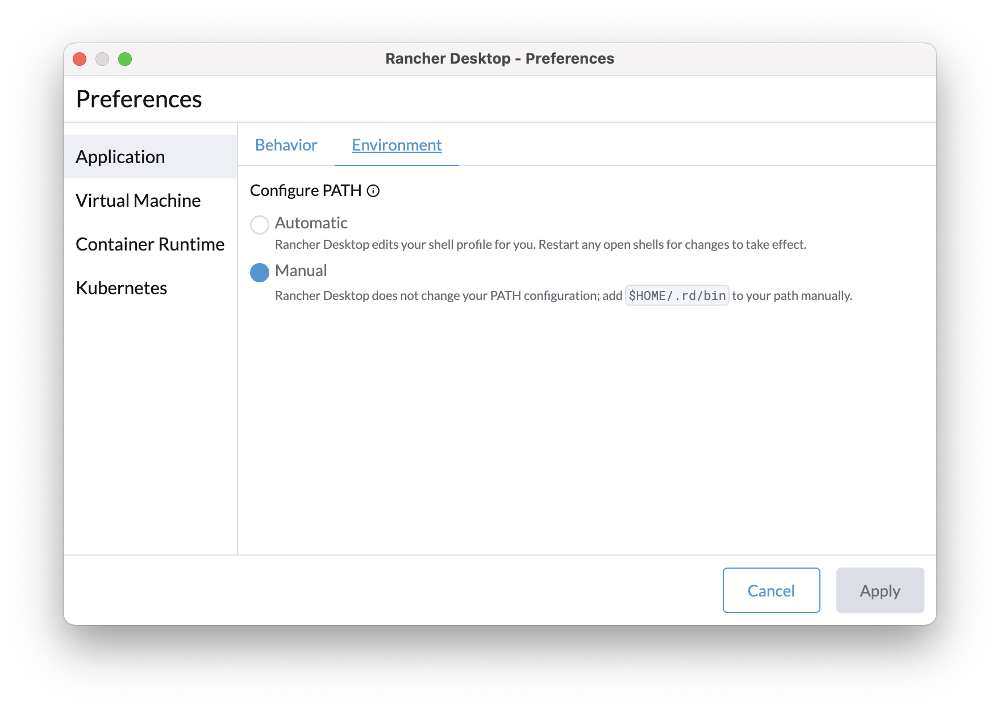
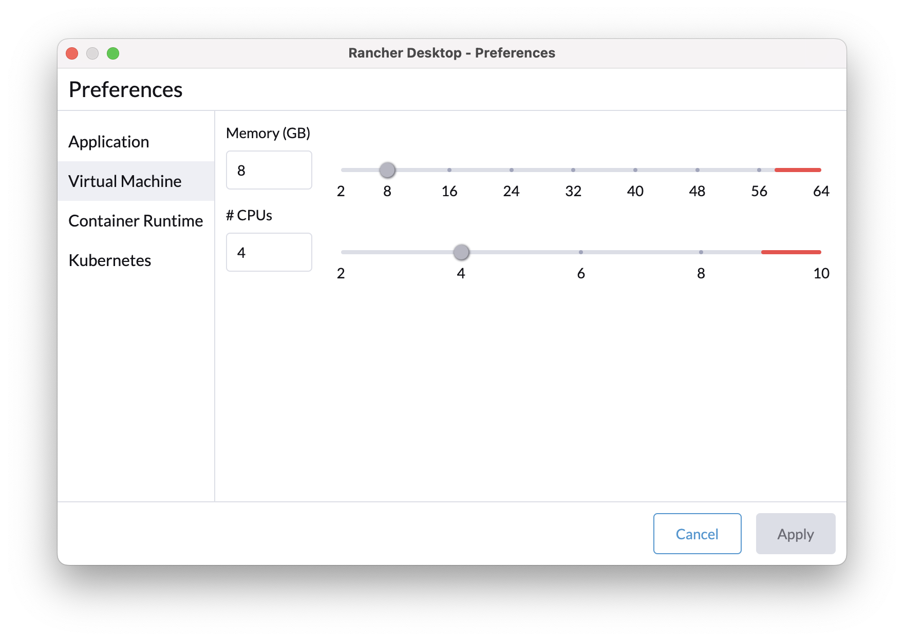
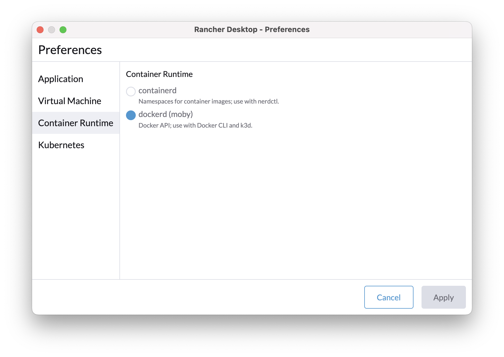
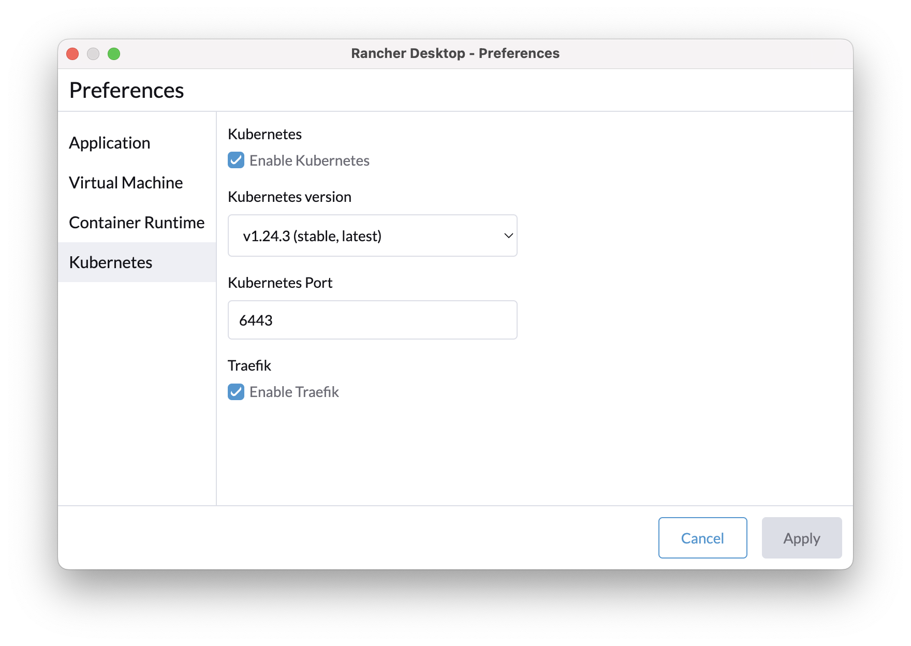

# Rancher Desktop

Provides **Docker**, **Kubernetes** runtime and CLI **tools** for local development.

**[Rancher Desktop](https://rancherdesktop.io)** Container Management and Kubernetes on the Desktop. Is the replacement
for **Docker for Mac**

Download and install the latest binary for your platform from [rancherdesktop.io](https://rancherdesktop.io/).
Unpack and move `Rancher Desktop.app` to `/Applications`<br/>
_e.g., Rancher.Desktop-x.y.z.aarch64.dmg for Mac M1_

It includes:

1. [lima](https://github.com/lima-vm/lima)
2. [containerD](https://containerd.io)
3. [k3s](https://k3s.io/)
4. [traefik](https://traefik.io/)

After _Rancher Desktop_ is installed, users will have access to these supporting utilities:

- [Helm](https://helm.sh/)
- [kubectl](https://kubernetes.io/docs/reference/kubectl/overview/)
- **rdctl** - this CLI can be used to do all action that you can do at _Rancher Desktop_ UI via command-line
    ```shell
    # example:
    rdctl list-settings
    rdctl set --container-runtime dockerd --kubernetes-version 1.24.3
    rdctl set --kubernetes-enabled=true
    rdctl shutdown
    ```

## Configuration

It is recommended assign:

* 8 GB of memory
* 4 CPU
* Enable **Traefik**

Make sure you enabled following settings. ie., `dockerd(moby)` , PATH manual etc.

|                                                     |                                                           |
| :-------------------------------------------------: | :-------------------------------------------------------: |
|  |  |
|              |          |
|            |                                                           |

## DevOps tools

Install optional DevOps tools for SREs

```shell
brew install kubectx # to switch kube context, namespace quickly. https://github.com/ahmetb/kubectx
brew install kubens # to switch kube  quickly
brew install kubernetes-helm # package manager for Kubernetes
brew install kustomize # Kubernetes native configuration management
brew install stefanprodan/tap/kustomizer # package manager for distributing Kubernetes configuration as OCI artifacts
brew install derailed/k9s/k9s # Manage Your k8s In Style!
brew install istioctl # Istio configuration command line utility
brew install dive # A tool for exploring a docker image, layer contents, and discovering ways to shrink the size of your Docker/OCI image
brew install crane # A tool for interacting with remote images and registries.
brew tap anchore/syft && brew install syft # SBOM tool
brew install cosign # Container Signing, Verification and Storage in an OCI registry.
brew install skaffold # build and deploy docker images
go install sigs.k8s.io/bom/cmd/bom@latest # Create SPDX-compliant Bill of Materials
```

## Usage

```shell
docker info
docker version
docker stats
docker top CONTAINER
docker volume ls
docker network ls
```

### Images

```shell
docker build .
docker tag
docker tag SOURCE_IMAGE[:TAG] TARGET_IMAGE[:TAG]

docker images
docker images

docker login -u aaaa -p bbb
# Log in to your repository, I am using GitHub container registry
export GITHUB_PACKAGES_TOKEN=ghp_YOUR_TOKEN
docker login -u {github_username} -p {[token](https://github.com/settings/tokens)} ghcr.io

# inspect image
docker image inspect redislabs/redismod:edge

# Remove one or more images
docker rmi docker.vectorized.io/vectorized/redpanda:v21.11.2

# default from docker.io
docker pull jwsy/jade-shooter:v1.1

docker images | grep jwsy
docker run -d -p 8080:80 jwsy/jade-shooter:v1.1
docker run -d -p 80:80 --name=nginx --restart=always nginx

# `e2a5` is output from above command
docker exec -it e2a5 sh
docker images
# save load
docker save -o local_jwsy_jade-shooter_v1.2.tar
docker load -i local_jwsy_jade-shooter_v1.2.tar
```

#### Encrypt image layers with [ocicrypt](https://github.com/containerd/nerdctl/blob/master/docs/ocicrypt.md).

```shell
openssl genrsa -out mykey.pem
openssl rsa -in mykey.pem -pubout -out mypubkey.pem
docker image encrypt --recipient=jwe:mypubkey.pem --platform=linux/amd64,linux/arm64 foo example.com/foo:encrypted
docker push example.com/foo:encrypted
```

#### Sign and Verify Container Image with [cosign](https://github.com/containerd/nerdctl/blob/master/docs/cosign.md) tool

```shell
# Generate a key-pair: cosign.key and cosign.pub
cosign generate-key-pair

# Export your COSIGN_PASSWORD to prevent CLI prompting
export COSIGN_PASSWORD=$COSIGN_PASSWORD
```

Sign the container image while pushing:

```shell
# Sign the image with Keyless mode
docker push --sign=cosign devopps/hello-world

# Sign the image and store the signature in the registry
docker push --sign=cosign --cosign-key cosign.key devopps/hello-world
```

Verify the container image while pulling:

```shell
# Verify the image with Keyless mode
docker pull --verify=cosign devopps/hello-world
```

```shell
# push first
docker push -ghcr.io/xmlking/grpc-starter-kit/base:v0.2.0
# then sigh and verify
COSIGN_EXPERIMENTAL=1 cosign sign ghcr.io/xmlking/grpc-starter-kit/base:v0.2.0
COSIGN_EXPERIMENTAL=1 cosign verify ghcr.io/xmlking/grpc-starter-kit/base:v0.2.0
```

#### Generate and upload the SBOM

We will use the **syft** to generate the SBOM and once its generated we will attach to image using **cosign**

```shell
# Let’s first generate the SBOM
syft packages ghcr.io/junaid18183/sampleapp:0.0.1 -o spdx  > latest.spdx
cosign attach sbom --sbom latest.spdx ghcr.io/xmlking/sampleapp:0.0.1
```

### Dive

To explore docker image layers:

```bash
dive spring-service:1.6.5-SNAPSHOT
```

### Compose

```shell
docker compose -f infra/redis.yml up redis
docker compose -f infra/redpanda.yml up redpanda
docker compose -f infra/redpanda.yml logs
docker compose -f infra/redis.yml down
docker compose -f infra/redpanda.yml down
# this will stop redpanda and remove all volumes
docker compose -f infra/redpanda.yml down -v

docker compose -f infra/redpanda.yml ps
# name of the container can be found from output of above command
docker exec -it infra_redpanda_1 /bin/bash
docker exec -it infra_redpanda_1 rpk version
docker exec -it infra_redpanda_1 rpk topic list
docker exec -it infra_redpanda_1 rpk cluster info


docker exec -it redpanda-1 \
rpk topic produce twitch_chat --brokers=localhost:9092
docker exec -it redpanda-1 \
rpk topic consume twitch_chat --brokers=localhost:9092
```

### traefik

How to expose **traefik** v2 dashboard?

create `dashboard.yaml` file

```shell
cat << 'EOF' > dashboard.yaml
apiVersion: traefik.containo.us/v1alpha1
kind: IngressRoute
metadata:
  name: dashboard
spec:
  entryPoints:
    - web
  routes:
    - match: Host(`traefik.localhost`) && (PathPrefix(`/dashboard`) || PathPrefix(`/api`))
      kind: Rule
      services:
        - name: api@internal
          kind: TraefikService
EOF
```

```shell
kubectl -n kube-system apply -f dashboard.yaml
```

open dashboard in your favorite browser and **don't forget the second slash**

```shell
open http://traefik.localhost/dashboard/#/
```

## Reference

-
StevenACoffman's [Docker Best Practices and Antipatterns](https://gist.github.com/StevenACoffman/41fee08e8782b411a4a26b9700ad7af5)
- [Signing images and creating SBOM using cosign](https://www.ijuned.com/Signing-images-and-creating-SBOM-using-cosign/)
- A collection of useful things you can do with `crane`
  is [here](https://github.com/google/go-containerregistry/blob/main/cmd/crane/recipes.md)
- [Compendium of Kubernetes Application Deployment Tools](https://medium.com/@KarlKFI/compendium-of-kubernetes-application-deployment-tools-80a828c91e8f)
- Make Docker container respond to SIGTERM and SIGINT for gracefully shutdown
    - [Zombie reaping problem](https://www.back2code.me/2020/02/zombie-processes/)
    - [Docker and the PID 1 zombie reaping problem](https://blog.phusion.nl/2015/01/20/docker-and-the-pid-1-zombie-reaping-problem/)