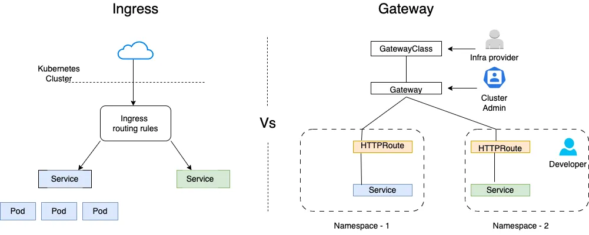
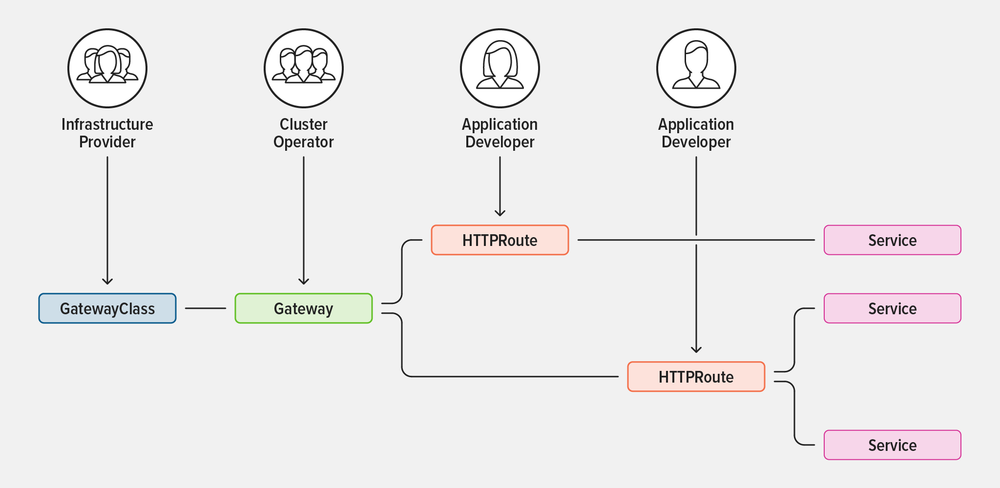

# Traefik

[Traefik proxy](https://doc.traefik.io/traefik/) is `reverse proxy` which can be used as `ingress` controller for workloads running in local `Docker Compose` or `Kubernetes` 

## Perquisites  
1. [helm](./docker-desktop.md#helm-optional)
2. [localhost.direct](https://get.localhost.direct/) as DNS for  **localhost** with HTTPS (SSL) and sub-domain support

Unzip [localhost.direct.zip](../apps/traefik/traefik/certs/localhost.direct.zip) password for cert file : `localhost`

Unpack `localhost.direct.zip`.

> HINT: password: `localhost`

```shell
unzip -P localhost apps/traefik/certs/localhost.direct.zip -d apps/traefik/certs/
```


## Traefik with Docker Compose

Use [compose.yml](../../apps/traefik/compose.yml), [certs](../../apps/traefik/certs/) and [traefik.yml. dynamic.yml](../../apps/traefik/) to setup docker compose env.


## Traefik with Kubernetes

Install and configure **Traefik Proxy** to use as *Gateway API* of Kubernetes  
We will be setting [localhost.direct](https://get.localhost.direct/) **FQDN** to point to your *localhost* *(127.0.0.1)* along with its wildcard certs.

Source: [Run Traefik with Kubernetes in Docker Desktop](https://doc.traefik.io/traefik/getting-started/install-traefik/)





1. Create **traefik** kubernetes namespace if not exists
```shell
kubectl create ns traefik
```

2. Create **wildcard-localhost-direct-tls** secret
```shell
kubectl create secret tls wildcard-localhost-direct-tls --cert apps/traefik/certs/localhost.direct.crt  --key apps/traefik/certs/localhost.direct.key -n traefik
# DANGER: following command is used to revert above changers ONLY if needed
kubectl delete secret wildcard-localhost-direct-tls -n traefik
```

3. Deploy Gateway API CRD's (One time Task)

```shell
# install CRDs if already not installed. 
#  kubectl get crd gateways.gateway.networking.k8s.io &> /dev/null || \
#   { kubectl kustomize "github.com/kubernetes-sigs/gateway-api/config/crd?ref=v1.0.0" | kubectl apply -f -; }

 kubectl get crd gateways.gateway.networking.k8s.io &> /dev/null || \
  { kubectl kustomize "github.com/kubernetes-sigs/gateway-api/config/crd?ref=v0.4.0" | kubectl apply -f -; }

# customresourcedefinition.apiextensions.k8s.io/gatewayclasses.gateway.networking.k8s.io created
# customresourcedefinition.apiextensions.k8s.io/gateways.gateway.networking.k8s.io created
# customresourcedefinition.apiextensions.k8s.io/httproutes.gateway.networking.k8s.io created
# customresourcedefinition.apiextensions.k8s.io/referencegrants.gateway.networking.k8s.io created

# DANGER: Remove the Gateway API CRDs if they are no longer needed:
kubectl kustomize "github.com/kubernetes-sigs/gateway-api/config/crd?ref=v0.4.0" | kubectl delete -f -
```

4. Deploying Traefik Proxy v3.0

> **Gateway API** is not installed on Kubernetes clusters by default.  

```shell
helm repo add traefik https://traefik.github.io/charts
helm repo update

# This will install and start traefik in your local cluster
helm install traefik \
traefik/traefik \
--namespace traefik \
--set image.tag=v3.0 \
--set ingressRoute.dashboard.entryPoints="{web,websecure}" \
--set experimental.kubernetesGateway.enabled=true \
--set tlsStore.default.defaultCertificate.secretName="wildcard-localhost-direct-tls" \
--wait

# DANGER: in case of you want to rollback above installation
helm uninstall traefik  --namespace traefik
```

5. Verify

```bash
kubectl get all -n traefik
kubectl describe svc traefik --namespace traefik | grep Ingress | awk '{print $3}'
```
The service named `service/traefik` should get a EXTERNAL-IP of `localhost` which can be seen in the list printed above

This means that you can access the Traefik load balancer by navigating to https://traefik.localhost.direct/dashboard/#/ in your browser.  

```shell
# kubectl port-forward $(kubectl get pods --selector "app.kubernetes.io/name=traefik" -n traefik --output=name) -n traefik 9000:9000
open https://traefik.localhost.direct/dashboard/#/
```

6. ALL DONE - Enjoy