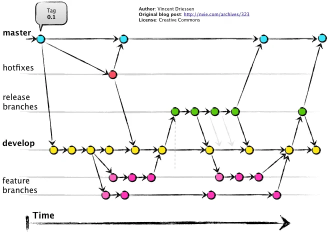
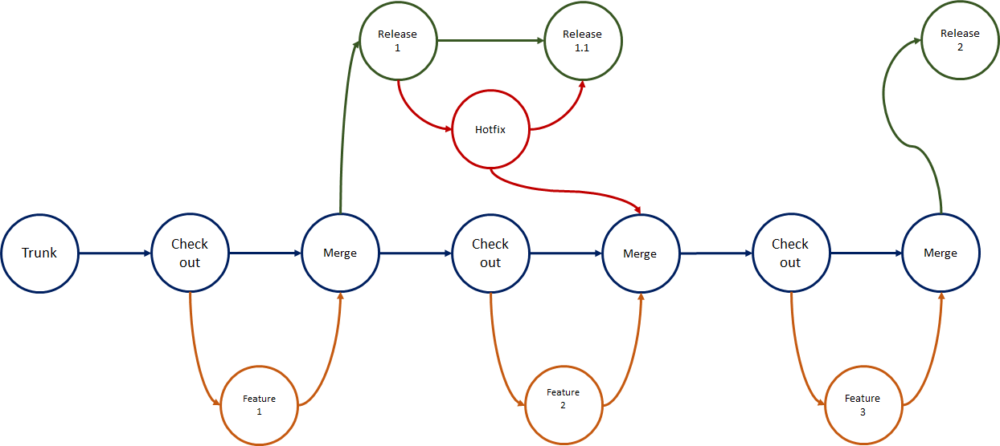
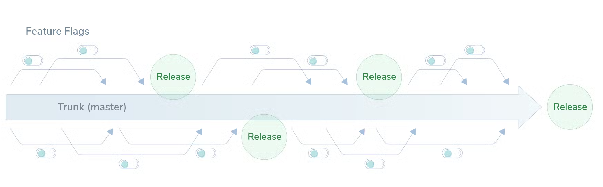

# Development Workflow

Adopting best practices for Git **Branching, Versioning, Conventional Commits**, and **Release** process.<br/>
Simplify **Developer Workflow** and provide a great **Developer Experience (DX)**

**Productivity Engineering**

Our ultimate goal:  1. Business value and  2.[Engineering excellence and culture](https://www.thoughtworks.com/insights/articles/engineering-productivity-governance-and-improvement-in-software-)

**Highlights**
- Monorepo (apps & libs)
- Scaled [Trunk-Based Development](https://trunkbaseddevelopment.com/) with [Feature Flags](https://launchdarkly.com/blog/introduction-to-trunk-based-development/)
- Fully automated release
- Enforce [Semantic Versioning](https://semver.org) specification
- Use formalized commit message convention to document changes in the codebase
- Publish on different distribution channels i.e, __SNAPSHOT__ on `develop, hotfix` branches and __Stable__ in `main` branch
- Avoid potential errors associated with manual releases

Here, we’ve standardised on:

- Scaled [Trunk-Based Development](https://trunkbaseddevelopment.com/) as _git branching model_
- [Semantic-Release](https://semantic-release.gitbook.io/semantic-release/) _for release process_
- [Semantic Versioning 2.0.0](https://semver.org/) _for versioning_
- [Conventional Commits](https://www.conventionalcommits.org/en/v1.0.0/) _for commit messages_

## Prerequisites 

**Git** installed via brew `brew install git`<br/>
And `which git` should output `/opt/homebrew/bin/git`.

Copy `.gitconfig` file as described in [Dotfiles](../../essentials/dotfiles.md) to your home directory. i.e., `~/.gitconfig`<br/>
Next, we'll define your Git user (should be the same name and email you use for GitHub):
```shell
git config --global user.name "Your Name Here"
git config --global user.email "your_email@youremail.com"
```

Also copy `.gitattributes` and `.gitignore` files as described in [Dotfiles](../../essentials/dotfiles.md) to your home's `my` directory. i.e., `~/my`<br/>
Customize your `.gitignore` visiting [gitignore.io](https://www.toptal.com/developers/gitignore?templates=macos) and fill it what you need.

## Install

1. [Cocogitto](https://docs.cocogitto.io) is a CLI for _Conventional Commits_ and _Semantic Versioning_.

   **Cocogitto** comes with two standalone binaries : `coco` and `cog`.<br/>
   **Note: `coco` has been deprecated in favor of the `cog commit` command.**

    ```shell
    # brew not available yet
    cargo install --locked cocogitto
    ```

   Add shell completions
   ```shell
   cog generate-completions zsh > /opt/homebrew/share/zsh-completions/_cog
   ```

2. [gitflow](https://github.com/petervanderdoes/gitflow-avh) git extension

   Check installation [instructions](https://github.com/petervanderdoes/gitflow-avh/wiki/Installation) for your platform.
    ```shell
    brew install git-flow-avh
    ```

3. [git-chglog](https://github.com/git-chglog/git-chglog)

    ```shell
    # CHANGELOG generator
    brew tap git-chglog/git-chglog
    brew install git-chglog
    ```

## Usage

### ~~Gitflow~~
[Gitflow](http://nvie.com/posts/a-successful-git-branching-model/) is a branching model for Git, created
by [Vincent Driessen](https://nvie.com/about/).  
It has attracted a lot of attention because it is very well suited to collaboration and scaling the development team.



Follow [Gitflow Usage](./gitflow.md)

> **Work-in-Progress:** We are switching to [Scaled Trunk-Based Development with Feature Flags](https://gitlab.com/gitlab-org/gitlab-ce/) from [GitFlow](https://nvie.com/posts/a-successful-git-branching-model/).<br/>
> This section will be updated soon.


### Scaled Trunk-Based Development



#### Trunk-Based Development with Feature Flags


### Cocogitto
[Cocogitto](https://docs.cocogitto.io) is a CLI and GitOps toolbox for the [Conventional Commits](https://www.conventionalcommits.org/en/v1.0.0/) and [Semver]((https://semver.org/)) specifications.

#### Configure
Initialize an existing repo with `cog init` which generate `cog.toml` file in project's root.
Customize as per [instructions](https://docs.cocogitto.io/config/#general)

Check commit history with `cog check`

To protect your commit history, and your git remote, cog have builtins [git hooks](https://git-scm.com/book/en/v2/Customizing-Git-Git-Hooks)

```shell
 # You can install them all Or one by one, specifying the hook name
cog install-hook all
cog install-hooks pre-push
cog install-hook commit-msg
```

`cog log`  displays additional conventional commit information.

#### Commit
To create conventional commits you can use the `cog commit` command.
Examples:
```shell
# cog commit [OPTIONS] <TYPE> <MESSAGE> [SCOPE]

# With cog
cog commit feat "add awesome feature" cli

# With git
git commit -m "feat(cli): add awesome feature"

# Breaking changes
cog commit fix -B "add fix a nasty bug" cli
# Commit Body and footers
cog commit refactor -e -B "drop support for Node 6" runtime 
```

#### Changelogs

`cog changelog` can generate changelog automatically.

You can specify a custom changelog range or tag like so :
```shell
# Display the changelog between `^1` and `2.0.0`
cog changelog --at 2.0.0

# From `8806a5` to `1.0.0`
cog changelog 8806a5..1.0.0

# From `8806a5` to `HEAD`
cog changelog 8806a55..

# From first commit to `1.0.0`
cog changelog 8806a5..1.0.0

cog changelog --at 0.1.0 -t remote --remote github.com --owner xmlking --repository  macbooksetup
cog changelog > CHANGELOG1.md
```

#### Automatic versioning
`cog bump` will calculate the next version based on your commit history since the latest semver tag.


### Changelog

On release branch, generate __CHANGELOG.md__ and commit it, before merging back to develop & main.

Generate changelog using [git-chglog](https://github.com/git-chglog/git-chglog).

The format is based on [Keep a Changelog](https://keepachangelog.com/en/1.0.0/), and adheres
to [Semantic Versioning](https://semver.org/spec/v2.0.0.html).

```shell
# first time
git-chglog --init
# on release branch, generate CHANGELOG.md and commit before merging back to develop & main.
git-chglog -c .github/chglog/config.yml -o CHANGELOG.md --next-tag 2.0.0
```


 ## References
- [Engineering productivity governance and improvement in software delivery](https://www.thoughtworks.com/insights/articles/engineering-productivity-governance-and-improvement-in-software-)
- [Git Branching Strategies vs. Trunk-Based Development](https://launchdarkly.com/blog/git-branching-strategies-vs-trunk-based-development/)
- [Trunk-Based Development with Feature Flags](https://launchdarkly.com/blog/introduction-to-trunk-based-development/)