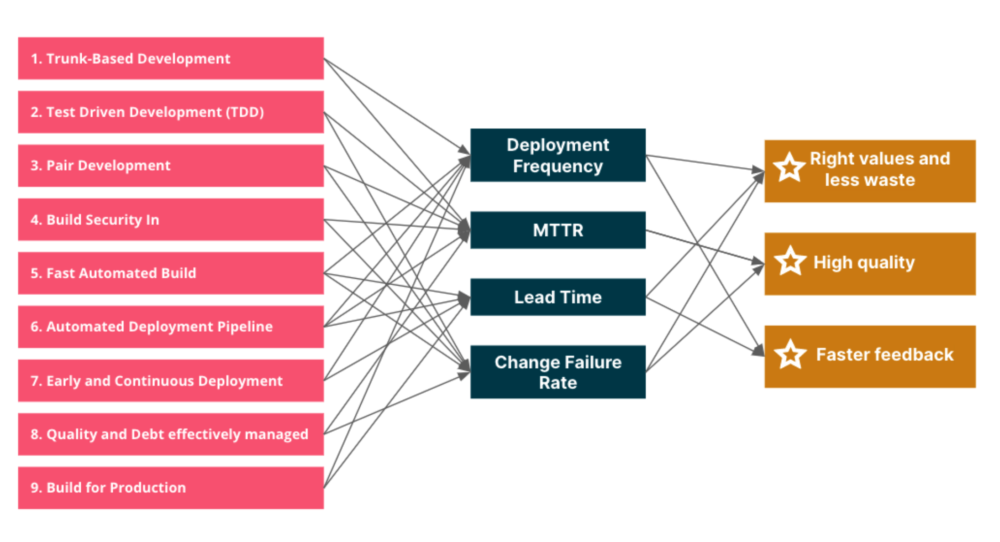
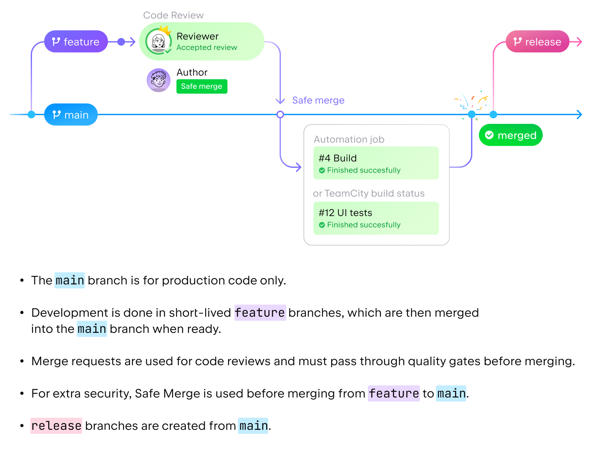

# Development Workflow

Adopting best practices for Git **Branching, Versioning, Conventional Commits**, and **Release** process.<br/>
Simplify **Developer Workflow** and provide a great **Developer Experience (DX)**

<p align="center">
  
</p>
<h3 align="center">Productivity Engineering</h3>

Our ultimate goal:
1. Business value
2. [Engineering excellence and culture](https://www.thoughtworks.com/insights/articles/engineering-productivity-governance-and-improvement-in-software-)

## Highlights
- Monorepo (apps & libs)
- [Scaled GitHub Flow](https://blog.jetbrains.com/space/2023/04/18/space-git-flow/) with [Feature Flags](https://launchdarkly.com/blog/introduction-to-trunk-based-development/)
- Fully automated release
- Enforce [Semantic Versioning](https://semver.org) specification
- Use formalized commit message convention to document changes in the codebase
- Publish on different distribution channels i.e, __SNAPSHOT__ on `develop, hotfix` branches and __Stable__ in `main` branch
- Avoid potential errors associated with manual releases

Here, we’ve standardised on:

- [Scaled GitHub Flow](https://blog.jetbrains.com/space/2023/04/18/space-git-flow/) as _git branching strategy_
- [Semantic-Release](https://semantic-release.gitbook.io/semantic-release/) _for release process_
- [Semantic Versioning 2.0.0](https://semver.org/) _for versioning_
- [Conventional Commits](https://www.conventionalcommits.org/en/v1.0.0/) _for commit messages_

## Prerequisites

**Git** installed via brew `brew install git`<br/>
And `which git` should output `/opt/homebrew/bin/git`.

Copy `.gitconfig` file as described in [Dotfiles](../../essentials/dotfiles.md) to your home directory. i.e., `~/.gitconfig`<br/>
Next, we'll define your Git user (should be the same name and email you use for GitHub):
```shell
git config --global user.name "Your Name Here"
git config --global user.email "your_email@youremail.com"
```

Also copy `.gitattributes` and `.gitignore` files as described in [Dotfiles](../../essentials/dotfiles.md) to your home's `my` directory. i.e., `~/my`<br/>
Customize your `.gitignore` visiting [gitignore.io](https://www.toptal.com/developers/gitignore?templates=macos) and fill it what you need.

## Install

### Cocogitto
[Cocogitto](https://docs.cocogitto.io) is a CLI for _Conventional Commits_ , _Semantic Versioning_ and Release.

#### Install
```shell
brew install cocogitto
```


## Usage

###  Branching Strategy

We will be using branching strategy that is based on `GitHub Fow`, but with a greater emphasis on safety when making changes to the `main` branch and the ability to scale to large projects and teams.



#### Main branch
A single `main` branch is always production-ready – the tests are green, and all changes are verified. The `main` branch is protected, meaning direct commits are not allowed. 

#### Feature branches
Changes to the code are made in a separate `feature` branch. Always create your `feature` branches from `main`. 

#### Merge requests and quality gates
To merge changes from a feature branch into main, you create a merge request that must pass through quality gates. Quality gates, which can be customized to fit your team’s workflow, are sets of conditions that have to be met in order to merge:

- Approval in a turn-based code review. A reviewer comments on the code and passes the turn to the author to make revisions until the changes are finally approved by the reviewer. 
- A successfully completed `GitHub Action` check job.
- **An external check**, which passes if an external CI/CD service like `Codecov` reports that the build is successful. 

#### Safe Merge
Safe Merge is an additional safety step before finally merging changes from a `feature` branch into `main`. 
GitHub Actions workflow perform quality checks with an Automation build and e2e testing in isolated env. If the checks are successful, the changes from `feature` are finally merged into `main`. 

#### Release branches
If your project involves public releases, you should use `release` branches created from `main`. If necessary, last-minute changes are cherry-picked from `main` to a particular `release` branch.

Following this flow allows you to configure `quality gates` to achieve higher-quality code and a stable, protected `main` branch, with:
- Safe Merge for feature branches.
- Code owners for mandatory reviews in critical code areas.
- GitHub Actions build status as quality gate criteria for merge requests.

### Cocogitto
[Cocogitto](https://docs.cocogitto.io) is a CLI and GitOps toolbox for the [Conventional Commits](https://www.conventionalcommits.org/en/v1.0.0/) and [Semver]((https://semver.org/)) specifications.

Check the [docs](https://docs.cocogitto.io/guide/#repository-initialization) for all sub commands and features.

#### Configure
Initialize an existing repo with `cog init` which generate `cog.toml` file in project's root.
Customize as per [Instructions](https://docs.cocogitto.io/config/#general)

You can copy language specific [GoLang](../../../apps/git/Go.cog.toml), [Java](../../../apps/git/Java.cog.toml),  [Node](../../../apps/git/Node.cog.toml) or [Generic](../../../apps/git/cog.toml) `cog.toml` file to your repository and customize it.<br/>

> Note: rename above file to `cog.toml`

#### Built-in git hooks
To protect your commit history, and your git remote, cog have builtins [git hooks](https://git-scm.com/book/en/v2/Customizing-Git-Git-Hooks)

We recommend installing at lease `commit-msg` hook for each of your repositories.

```shell
 # You can install them all Or one by one, specifying the hook name
cog install-hook all
cog install-hooks pre-push
cog install-hook commit-msg
# If you need to bypass `git hooks` use the --no-verify flag.
git commit -m "WIP" --no-verify
```

#### Commit
To create conventional commits you can use the `cog commit` command.
Examples:
```shell
# cog commit [OPTIONS] <TYPE> <MESSAGE> [SCOPE]

# With cog
cog commit feat "add awesome feature" cli

# With git
git commit -m "feat(cli): add awesome feature"

# Breaking changes
cog commit fix -B "add fix a nasty bug" cli
# Commit Body and footers
cog commit refactor -e -B "drop support for Node 6" runtime

# Commit with skip-ci
cog commit docs "added cli options" cli --skip-ci "[skip ci]"
```

#### Check commit history

* Running `cog log`  displays additional conventional commit information.
* Running `cog check` will check your commit history against the conventional commit specification

```shell
cog log
cog check -l
# Options: --from-latest-tag or -l
```

#### Rewrite non-compliant commits
Once you have spotted invalid commits you can quickly fix your commit history by running `cog edit`.

> DANGER: Using `cog edit` will modify your commit history and change the commit SHA of edited commit and their child.

```shell
cog edit -l
# Options: --from-latest-tag or -l
```

Alternatively, you can use `git commit --amend` to fix commit messages:

```shell
# changing the latest Git commit message
git commit --amend -m "fix(account): fix account create bug"
# git push --force-with-lease repository-name branch-name
git push --force-with-lease origin main
```
> If you want to rewrite multiple `non-conventional commit` messages, follow: [How to change a Git commit message after a push](https://www.educative.io/answers/how-to-change-a-git-commit-message-after-a-push)

#### Changelogs

`cog changelog` can generate changelog automatically.

You can specify a custom changelog range or tag like so :
```shell
# Display the changelog between `^1` and `2.0.0`
cog changelog --at 2.0.0

# From `8806a5` to `1.0.0`
cog changelog 8806a5..1.0.0

# From `8806a5` to `HEAD`
cog changelog 8806a55..

# From first commit to `1.0.0`
cog changelog 8806a5..1.0.0

cog changelog --at 0.1.0 -t remote --remote github.com --owner xmlking --repository  macbooksetup
cog changelog > CHANGELOG1.md
```

#### Automatic versioning
`cog bump` will calculate the next version based on your commit history since the latest semver tag.

The bump subcommand will execute the following steps :

1. Calculate the next version based on the commit types since the latest tag.
2. Append the changes for this version to `CHANGELOG.md`.
3. Execute a set configuration defined pre-bump hooks.
4. Create a version commit containing changes made during the previous steps.
5. Create a git tag on the version commit.
6. Execute a set of configuration defined post-bump hook.

This following command bump VERSION number and push **changes** and **tag** to remote
```shell
# create tag with specified full VERSION
cog bump -v <VERSION>
# create tag with specified patch version part bumped
cog bump --patch --pre "beta.1"
# dry-run: calculate the next version based on the commit types since the latest tag
cog bump --auto --dry-run
# calculate the next version based on the commit types since the latest tag
cog bump --auto
# with skip-ci
cog bump --auto --skip-ci "[skip-ci]"
```

#### Get the current version 
```shell
cog get-version
cog -v get-version
# If working on a monorepo you can also specify the target package:
cog -v get-version --package gill-db
cog get-version --fallback 0.1.0
```


#### GitHub Actions
Check the _GitHub Actions_ for **Cocogitto** [Here](../../../.github/workflows)


 ## References
- [Engineering productivity governance and improvement in software delivery](https://www.thoughtworks.com/insights/articles/engineering-productivity-governance-and-improvement-in-software-)
- [Git Branching Strategies vs. Trunk-Based Development](https://launchdarkly.com/blog/git-branching-strategies-vs-trunk-based-development/)
- [Trunk-Based Development with Feature Flags](https://launchdarkly.com/blog/introduction-to-trunk-based-development/)
- [Introducing the Space Git Flow](https://blog.jetbrains.com/space/2023/04/18/space-git-flow/)