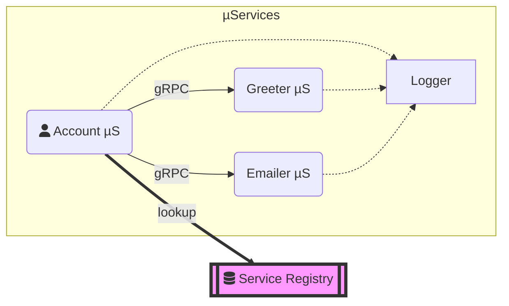

# documentation

Documentation is key for any project success.
When team members move to different projects, the **[Tribal Knowledge](https://www.lucidchart.com/blog/what-is-tribal-knowledge)** will be lost, and it would be hard for new maintainers keep the project on track as per the original _Roadmap_.
We believe in [Docs as Code](https://www.writethedocs.org/guide/docs-as-code/) philosophy and keep related documents close to code in the same repository.

Docs should be organized  under `docs` folder in the root of the repo. <br/>
We recommend [GitHub Flavored Markdown](https://github.github.com/gfm/) for writing documents and leverage [draw.io](https://app.diagrams.net) and [Mermaid](https://github.blog/2022-02-14-include-diagrams-markdown-files-mermaid/) to embed diagrams directly into _Markdown_ files.

Recommended minimal documentation for each project: 

* **README.md** - Should contain Project goals, big picture, list of features, developer's workflow to contribute to repo. 
* **[Project Boards](https://docs.github.com/en/issues/organizing-your-work-with-project-boards/managing-project-boards)** to keep tracking releases, milestones, features and project status. 
* **Roadmap** should include short and long term goals. 
* **[Code Owners](https://docs.gitlab.com/ee/user/project/code_owners.html)** -  [CODEOWNERS](https://docs.github.com/en/repositories/managing-your-repositorys-settings-and-features/customizing-your-repository/about-code-owners) file contain resources who own specific module in the repository and who should review before PRs are merged.  
* **Architecture Decision Record [(ADR)](https://github.com/xmlking/grpc-starter-kit/blob/develop/docs/adr/ADR.md)** - is a document that captures an important architectural decision made along with its context and consequences.
* **Style Guide** - Coding Style Guide

## Markdown

Extra GitHub Markdown tricks 
### Folding area

```
<details>
<summary>Fold/Open</summary>
Folded content
</details>
```
 
<details>
<summary>Fold/Open</summary>
Folded content
</details>


### diff

```
function compare (num1, num2) {
-  return ALL_SAME;
+  return NOT_SAME;
}
```

```diff
function compare (num1, num2) {
-  return ALL_SAME;
+  return NOT_SAME;
}
```

### Checkbox

```
Future improvements:
- [ ] Point 1
- [ ] Point 2
- [x] Point 3
```

Future improvements:
- [ ] Point 1
- [ ] Point 2
- [x] Point 3


### Table of contents
To generate it, markdown provides a shortcut: An easy auto-generation. All the titles defined with #will be edited into the table of contents if the [TOC] is added in the appropriate place.

### Image adjustment

#### Size adjustment
``` 

```


#### Image position control
``` 
<div align="center"></div>
```

### Diagrams

#### mermaid

```
graph LR;
    subgraph µServices
    A(fa:fa-user Account µS)--gRPC-->G(Greeter µS) & E(Emailer µS);
    A & G & E -.-> L[Logger]
    end
    A ==lookup==> SR[[fa:fa-database Service Registry]];
    style SR fill:#f9f,stroke:#333,stroke-width:4px
```



#### Draw.io

```
<div align="center">
  
</div>
```
<div align="center">
  
</div>

### Footnote

Here need a footnote[^noteID1].

[^noteID1]: Here is the quote for **ID1**.

## Reference 
[The Magical Markdown I Bet You Don’t Know](https://medium.com/codex/the-magical-markdown-i-bet-you-dont-know-b51f8c049773)