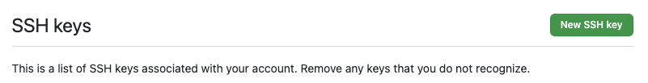
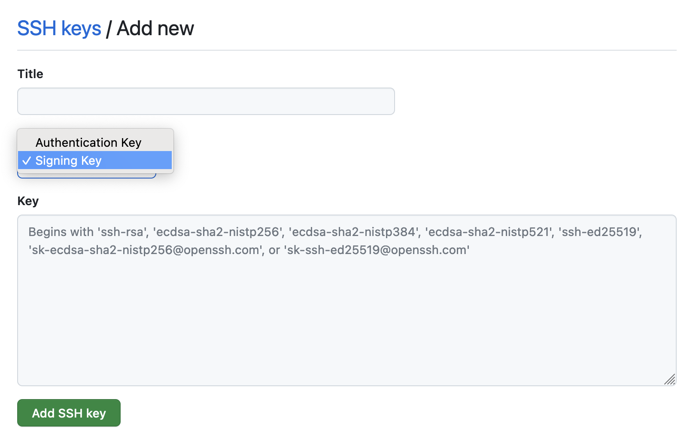

# GitHub

Setting up GitHub and your development environment so you can sign Git commits is simple and it means you get those nice verified badges on GitHub! More importantly, in the age of supply chain attacks and mistrust, signing commits is a great way of proving who you are and building trust for the systems you work with.

> Note: This post is focussed on `MacOS` and worked for me on `Sonoma`

## Setup

### Create New SSH key

With your favorite terminal, create a new SSH key.

```shell
> ssh-keygen -t ed25519 -C "your_email@example.com"
Generating public/private ed25519 key pair.
Enter file in which to save the key (/Users/xyz/.ssh/id_ed25519): 
Enter passphrase (empty for no passphrase): 
Enter same passphrase again: 
Your identification has been saved in /Users/xyz/.ssh/id_ed25519
Your public key has been saved in /Users/xyz/.ssh/id_ed25519.pub
The key fingerprint is:
SHA256:ZV4ihskZK*****************************Fb2s your_email@example.com
```

This creates a new SSH key, using the provided email as a label.

When you're prompted to *Enter a file in which to save the key*, you can press Enter to accept the default file location. Please note that if you created SSH keys previously, ssh-keygen may ask you to rewrite another key, in which case we recommend creating a custom-named SSH key. To do so, type the default file location and replace id_ssh_keyname with your custom key name.

```shell
Enter a file in which to save the key (/Users/YOU/.ssh/id_ALGORITHM): [Press enter] 
```

At the prompt, type a secure passphrase. For more information, see [Working with SSH key passphrases](https://docs.github.com/en/enterprise-cloud@latest/authentication/connecting-to-github-with-ssh/working-with-ssh-key-passphrases?platform=mac).

```shell
> Enter passphrase (empty for no passphrase): [Type a passphrase]
> Enter same passphrase again: [Type passphrase again]
```

### Upload Key to GitHub as Signing Key

```
pbcopy < ~/.ssh/id_ed25519.pub
```

Login to your GitHub account and go to **->settings->keys** and click the **‘New SSH key’ button** or just click the link below. https://github.com/settings/ssh/new



Next, change the key type drop down to ‘Signing Key’, give your key a title and paste in the contents to the Key box. The previous `pbcopy` command copied the key to your clipboard.



Once you’ve done that, hit **‘Add SSH key’**.

### Adding Your New SSH Key to the `ssh-agent`

```shell
eval "$(ssh-agent -s)"
# Let's start by listing the current keys in the agent using the following command:
ssh-add -l
# Let's add our first key to the agent! If you haven't changed the default folder and file name, you can use the following command:
ssh-add --apple-use-keychain ~/.ssh/id_ed25519
# Enter previously used passphrase when prompted
```

> Note: The `--apple-use-keychain` option stores the passphrase in your keychain for you when you add an SSH key to the ssh-agent. If you chose not to add a passphrase to your key, run the command without the `--apple-use-keychain` option.

### Create Local Git Client Config
Signing Commits with SSH
```shell
touch ~/.ssh/allowed_signers

git config --global gpg.format ssh
git config --global commit.gpgsign true
git config --global gpg.ssh.allowedSignersFile ~/.ssh/allowed_signers
git config --global user.signingkey ~/.ssh/id_ed25519.pub
```

The block above also assumes that you have a  `~/.gitconfig` file in place. Mine looks like this after the steps above.

```toml
[user]
        name = Your Full Name
        email = your_email@example.com
        signingkey = /Users/xyz/.ssh/id_ed25519.pub
[gpg]
        format = ssh
[commit]
        gpgsign = true
[gpg "ssh"]
        allowedSignersFile = /Users/xyz/.ssh/allowed_signers
```

### Creating an SSH Config File

If the config file doesn't exist initially, you can create it by running the following command:
```shell
touch ~/.ssh/config
chmod 600 ~/.ssh/config
```

Typically, an SSH config file looks like this:

```
Host github.com
  AddKeysToAgent yes
  UseKeychain yes
  IdentityFile ~/.ssh/id_ed25519
```

### Create allowed_signers

Now we need to populate the `allowed_signers` file you created in the block above. The pattern for that block goes `<email> <key_type> <key_id>`, so my file looks like:

```shell
> cat ~/.ssh/allowed_signers

your_email@example.com ssh-ed25519 AAAAB3NzaC1lKDI1NTE5AAAAIFZSV8LQpdNrwUrR4jB8eHnuH6ZKuqJwjdmis1UUBXG1
```

> `<key_id>` can be found in `~/.ssh/id_ed25519.pub` 

You can add multiple users if you wish, with each user's email and public key on a separate line.

## Test

Before testing, ensure that the email that you’re using is in GitHub as a registered email adddress, else your verification status will be `unverified`, womp womp.

You can either add a test commit or create a phony project to sign a commit with. I did this to an existing repository. The `-S` flag below is for signing the commit, the `--allow-empty` will force a commit without any changes in the repo, the `--message` is a commit message string and `--signoff` will do a commit sign-off (not the same as sign).

```shell
git commit -S --allow-empty --message="test: Testing SSH signing" --signoff
git log --show-signature -1
```

You should now see a "Verified" label next to your commits.

GitHub — Verified Commit

Congratulations! You've successfully finished this tutorial ✌️

## Resources

