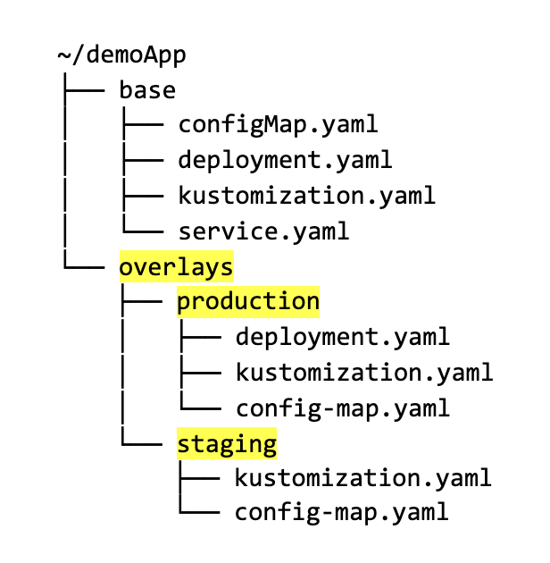

# Kustomize

**[Kustomize](https://kustomize.io)** is a Kubernetes native configuration management tool.

## Style Guide

### Project Layout

## Reference 
- [Applied GitOps with Kustomize](https://codefresh.io/about-gitops/applied-gitops-with-kustomize/)