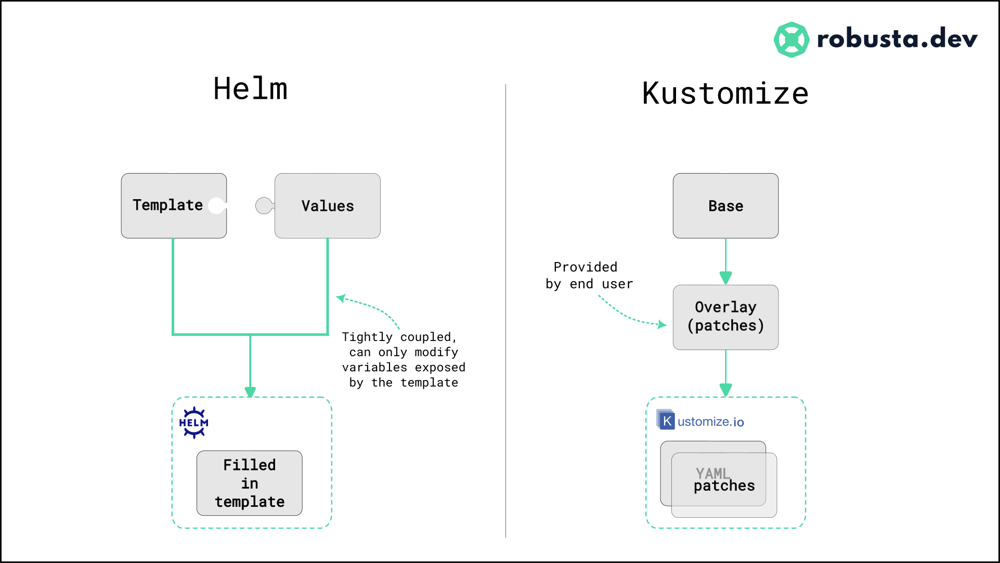

# Kustomize

**[Kustomize](https://kustomize.io)** is a Kubernetes native configuration management tool.

[Why Kustomize?](https://whyk8s.substack.com/p/why-kustomize)

## Help vs. Kustomize

Helm templates consist of:

- Templated YAML files (the template)
- A values file (template variables)

Kustomized files consist of:

- Base YAML files (the base)
- A modifications file (the overlay)

On the surface, these two approaches seem similar. However, they’re fundamentally different.

## Style Guide

Kustomizations should be treated as code and code should be clean.
1. Use `kustomize cfg fmt` to format your yaml configuration. It will ensure consistent field ordering and indentation.
2. Always use generators to emit `ConfigMap` (with `configMapGenerator`) and `Secret` (with `secretGenerator`) resources. Generators add a content hash to the resource name which ensures that rolling updates are triggered when the content changes.
3. Use a consistent naming scheme for resources. We recommend the following format: `<metadata.name>.<lowercase(kind)>.yaml`. Use the most significant part of a resource `apiVersion` instead of `<kind>` in the case where a single file stores multiple resources. E.g. use `rbac` for the RBAC example above.
4. Use [official common labels](https://kubernetes.io/docs/concepts/overview/working-with-objects/common-labels/)

### Project Layout

## Reference 
- [Applied GitOps with Kustomize](https://codefresh.io/about-gitops/applied-gitops-with-kustomize/)
- [Kustomize Best Practices](https://www.openanalytics.eu/blog/2021/02/23/kustomize-best-practices/)