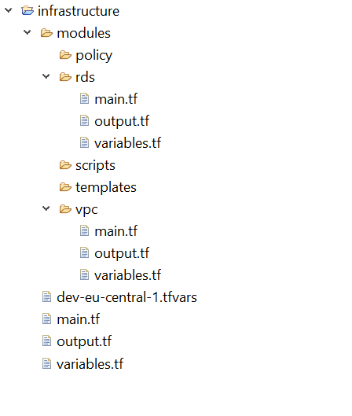

# Terraform

[Terraform](https://www.terraform.io) and [Terragrunt](https://terragrunt.gruntwork.io) are Infrastructure as Code (IaC) tools.

## Install

## Usage

## Style Guide  

Coding style Guide

### Overview

A typical infrastructure of a product can be categorized into the following three categories :

* _Global infra:_ This infrastructure contains the components which acts as the foundation of the overall infra across the product. The infra at this layer should mostly consist of setting up the networking — vpc ,subnets ,acl etc , dns and so on.
* _Common Infra:_ This layer consists of the infra which is needed by more than one service. Examples would be Redis Cluster , GKE Cluster etc.
* _Service Infra:_ This layer consists of infra which is service specific and should reside alongside the code repository of the service itself. Example: rds for a service would reside alongside the code of the service.

### Project Layout

All the terraform code written should follow a consistent code structure. Below can be an example:

* _modules :_ This folder should contain terraform code for resource creation . Examples : vpc,rds,subnets etc. Creating modules promotes reusability, hence reducing code duplication. Also each of the sub-folders/resources in modules should contain a structure like : main.tf , variables.tf , output.tf
* _policy :_ This folder should contain policy documents such as IAM role policies as json files .So this folder should act as a collection of policies which would be used by the modules folder. Examples : rds_iam_role_polcy.json , etc.
* _scripts :_ The folder should contain any scripts such as shells scripts or python scripts used for any resource handling or creation . Hence it acts a common place of any kind of script we write for our infra.
* _templates :_ In terraform we can use “.tpl” files for various purpose , in such a case we can keep those files in this folder for clarity.
* _main.tf :_ This file acts the entry point when we call terraform commands like init, validate , plan ,deploy and destroy.
* _output.tf :_ The outputs which need to be written to the state should be present here.
* _variables.tf :_ The variables used should be present in this file.
* _{env}-{region}.tfvars :_ Examples of such files are :
  * For dev and region — eu-central-1 , the expected file name should be : dev-eu-central-1.tfvars .
  * For int and region — eu-central-1 , the expected file name should be : int-eu-central-1.tfvars and so on.
      The files contain initialized values for the variables declared in variables.tf file.

## References

* [Infrastructure as a code best practices : Terraform](https://medium.com/@ranjana-jha/infrastructure-as-a-code-best-practices-terraform-d7ae4291d621)
