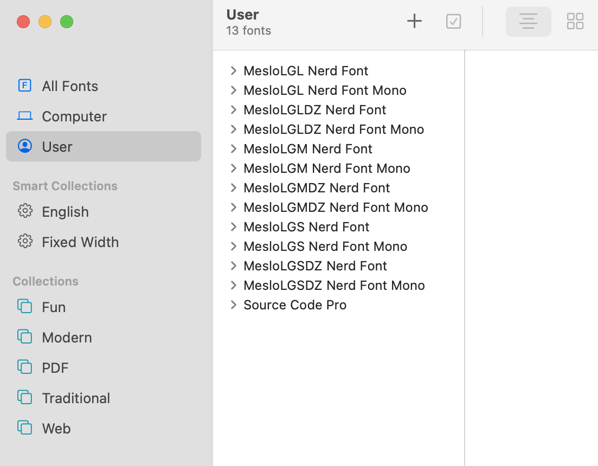

# Essentials

**MacOS** comes with `python3`, `ruby`, `git` _preinstalled_. <br/>
We will install other missing essential tools used frequently by _Developers_. 

### Command-line tools
Install essential _command-line tools_

* [watch](https://cli.github.com/) — `watch` will run a command repeatedly and then display the output in an `ncurses` friendly manner. 
* [jq](https://stedolan.github.io/jq/) —  `jq` is like `sed` for JSON data
* [git](https://git-scm.com/) — `git` is a version control system CLI
* git-flow-avh
* git-chglog

#### Better CLI Alternative Tools
 
* [gh](https://cli.github.com/) —  `GitHub CLI` brings GitHub to your terminal. 
* [bat](https://github.com/sharkdp/bat) — A syntax highlighting clone of `cat` and can stand in for `less`
* [delta](https://github.com/dandavison/delta) — A syntax highlighting pager for `diff`-ing
* [fd](https://github.com/sharkdp/fd) — A user-friendly version of `find`
* [htop](https://htop.dev/) — An interactive replacement for `top`
* [procs](https://github.com/dalance/procs) — A modern replacement for `ps`
* [exa](https://the.exa.website/) — A modern replacement for `ls`
* [ripgrep](https://github.com/BurntSushi/ripgrep) — An improved `grep`
* [dust](https://github.com/bootandy/dust) — A more intuitive version of `du`
* [duf](https://github.com/muesli/duf) — A better `df` alternative
* [prettyping](https://github.com/denilsonsa/prettyping) —A pretty wrapper around `ping`

```shell
brew install watch
brew install jq

brew install git
brew install gh # GitHub official command line tool.
# for first time use, run `gh auth login`


# Better CLI alternative Tools
brew install ack
brew install tree
brew install vim
brew install subversion # Yes, it is required to install some brew formulas :(
brew install exa # replacement for LS. https://the.exa.website
brew install bat # a better `cat`
brew install git-delta  # a better git `diff`
brew install fd # user-friendly alternative to `find`
brew install ripgrep # a better `grep` use: rg
brew install htop # a better `top`
brew install httpie
brew install go-task/tap/go-task # better then a Makefile
```

### Fonts
We need developer friendly fonts for **Terminals** (_iterm2, macOS Terminal app_) and **Editors** (_IntelliJ, VSCode,  sublime-text_) to enhance visual experience.
You can explore various fonts for IDEs at [Programming Fonts](https://www.programmingfonts.org) website. 

We recommend:
* **Editor Font:** _Source Code Pro, Fira Code or [Jetbrains Mono](https://www.jetbrains.com/lp/mono/)_
* **Terminal Font:** _Meslo LG, FiraCode Nerd Font or Hack Nerd Font_ from [nerd-fonts](https://www.nerdfonts.com/font-downloads)

```shell
brew tap homebrew/cask-fonts

# Terminal Fonts
# brew install --cask font-<FONT NAME>-nerd-font
brew install --cask font-meslo-lg-nerd-font
#brew install --cask font-fira-code-nerd-font
#brew install --cask font-hack-nerd-font

# Editor Fonts
brew install --cask font-source-code-pro
#brew install --cask font-fira-code
#brew install --cask font-jetbrains-mono
```


After installing your choice of font, you have to configure each _Editor_ and _Terminal_ to use this font, which is covered in [Apps](../apps) section.

### Apps
Install essential _Apps_ via brew cask

Since many of us won't have _admin_ rights on **Company** issued MacBooks, we will be installing software into **User's** Applications (i.e., `~/Applications`) directory:<br/>

> If you have admin privilege, you can skip `--appdir=~/Applications` flag

#### Development Tools
- [iterm2](https://iterm2.com): macOS Terminal Replacement
- [Sublimetext](https://www.sublimetext.com): lightweight text/markdown editor
- [VSCode](https://code.visualstudio.com): lightweight code editor
- [Jetbrains](https://www.jetbrains.com/toolbox-app/): toolbox to install jetbrains IDEs

```shell
brew install --cask --appdir=~/Applications iterm2
brew install --cask --appdir=~/Applications sublime-text
brew install --cask --appdir=~/Applications visual-studio-code
brew install --cask --appdir=~/Applications jetbrains-toolbox
```

Other benefit of installing `Apps` via `Brew` is, it links binaries to `/opt/homebrew/bin` which is added to `$PATH`.

    'subl' to '/opt/homebrew/bin/subl'
    'code' to '/opt/homebrew/bin/code'

So, you can open _projects/directors_ from command-line in _VSCode_ or _Sublime-text_ with:
```shell
code ~/Developer/Work/tools/macbooksetup
subl ~/Developer/Work/tools/macbooksetup
```

#### Productivity
- [Alfred](https://www.alfredapp.com): Spotlight on steroids.

```shell
brew install --cask --appdir=~/Applications alfred
```

#### Other 
- Google Chrome
- Microsoft Remote Desktop: rdp (optional)
- [OBS](https://obsproject.com): Record your screen with audio, mouse highlight and other features. (optional)
- [logitech-options](https://www.logitech.com/en-us/software/options.html): logitech driver, install only if you have _MX mouse_ (optional)
- [zoom](): app for meetings (optional)
- [slack](): app for communication (optional)

```shell
brew install --cask --appdir=~/Applications google-chrome
brew install --cask --appdir=~/Applications microsoft-remote-desktop
brew install --cask --appdir=~/Applications obs
# Logitech Options software - will prompt for password.
brew tap "homebrew/cask-drivers"
brew install --cask --appdir=~/Applications logitech-options
# Remote communication (optional)
brew install --cask --appdir=~/Applications zoom
brew install --cask --appdir=~/Applications slack
```

#### Mac App Store apps

Install apps from `Mac App Store` with [mas](https://github.com/mas-cli/mas)

Usage
```shell
brew install mas
# search 
mas search Xcode
# install 
mas install <appID>
# list installed apps
mas list
# list all applications with pending updates.
mas outdated
# To install all pending updates run:
mas upgrade
```


- [Magnet](https://apps.apple.com/us/app/magnet/id441258766?mt=12): window management (optional)
- [Twitter](https://twitter.com/): micro blog for tech news (optional)

```shell
# Magnet
mas install 441258766
# Twitter
mas install 409789998
```

Customize above applications further from: [Apps](../apps) docs
