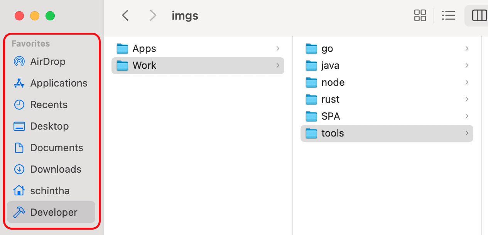
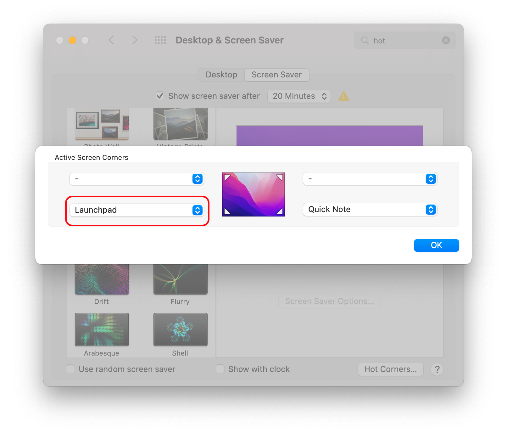
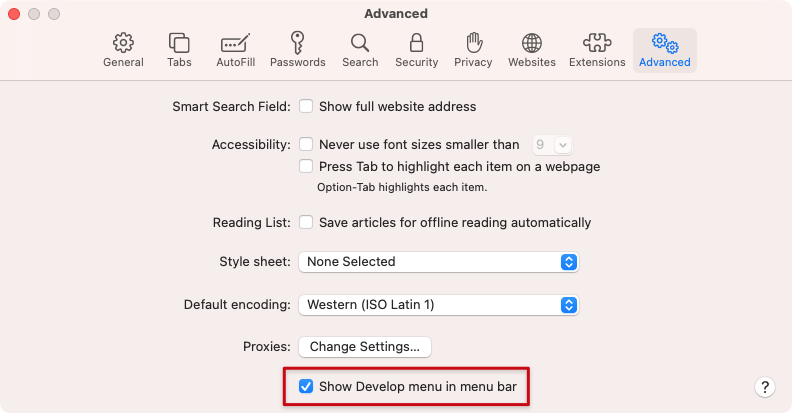

# System Preferences

The first thing you should do is update your system. To do that go: **Apple menu () > About This Mac > Software Update.**

## Users & Groups

* Login Options -> Change fast user switching menu as Icon
* Set up Password, Apple ID, Picture, etc.

## Trackpad

* Point & Click
  * Change _Secondary click_ `Click in bottom right corner`
  * Enable _Tap to click_ - `Tap with one finger`

## Mouse

* For Apple Magic Mouse
* Enable `Secondary click --> click on right side`

## Dock

* Visual Settings
  * Change position to _Left_ and make the size of icons _Small_
  * Check `Automatically hide and show the Dock`
  * Uncheck `Show recent applications in Dock`

## Mission Control

Launch “System Preferences” from the  Apple menu, and click on Mission Control

* Uncheck the box next to “Automatically rearrange spaces based on most recent use”

## Finder

* General
  * Change New finder window show to open in your Home Directory
* Sidebar
  * make a `Developer` Directory if not exist: `mkdir -p ~/Developer`
  * Add _Home_(`~/<username>`) and your _Code_ (`~/Developer`) Directories
  * Uncheck all _Shared_ boxes

## Menubar

* Add the _Display_ and _Bluetooth_ icons
* Change _battery to Show percentage symbols_

## Hot Corners

Got to `Desktop & Screen Saver` _Setting_ and open `Hot Corners...` add `Lanchpad`

## Spotlight

Removing irrelevant search results:

Uncheck _fonts, images, files_ etc.
Uncheck the _keyboard shortcuts_ as we'll be replacing them with [Alfred](https://www.alfredapp.com)

in `Privacy` tab, I added:

1. `~/go`

## Accounts

* Add an _iCloud_ account and sync _Calendar, Find my Mac, Contacts_ etc.

## Security & Privacy

* Set R`equire Password ... after sleep or screen saver begins to immediately`
* Enable FileVault to encrypt your hard drive
* Turn on Firewall

## Safari

### Session

* Safari --> Preferences --> General
  * _Safari open with:_ `All windows from last session`

### Developer Menu

> Before you can access the developer console in Safari, you first need to enable the **Developer Menu**. To do that, go into Safari's preferences (**Safari Menu > Preferences**) and select the **Advanced Tab**.

