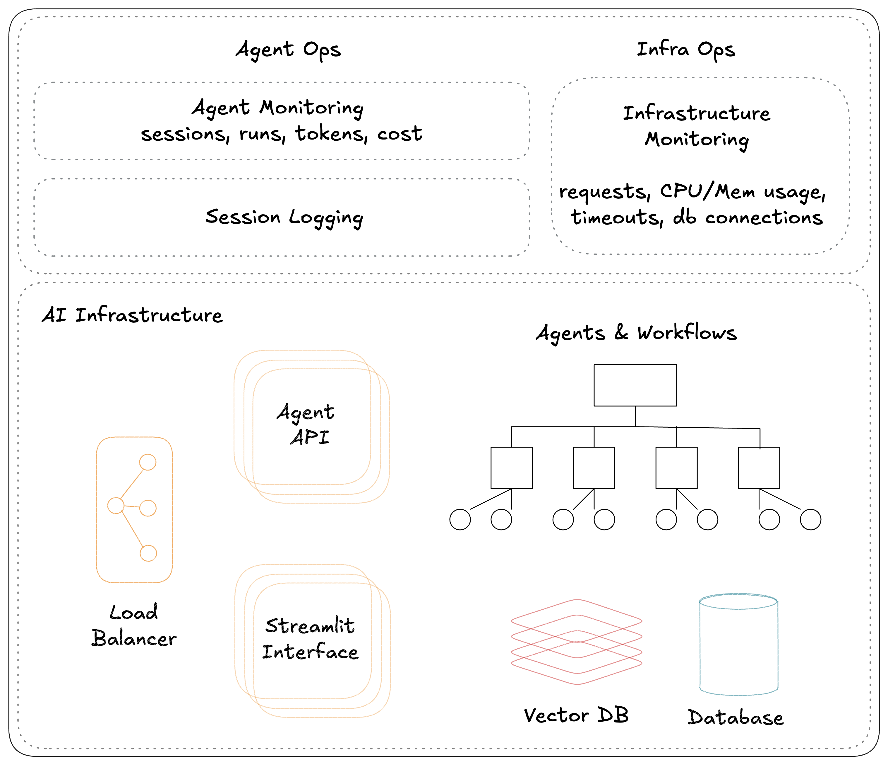

# Agno

[Agno](https://docs.agno.com/) is a lightweight library for building Multimodal Agents.



## Prerequisite

- [uv](./uv.md)
- [docker](../../apps/orbstack.md)

## Install

Install **Agno CLI**  globally.

```shell
uv tool install "agno[aws]"
```

## Setup

### Create a new [workspace](https://docs.agno.com/workspaces/introduction)

> [!NOTE]
> Agno Workspaces are standardized codebases for running *Agentic Systems* locally using Docker and in production on AWS.  
> They help us manage our *Agentic System* as code.

```shell
ag ws create --template agent-app --name agent-app
# or use aws app template
ag ws create -t agent-app-aws -n agent-app
# or use aws api template
ag ws create -t agent-api-aws -n agent-api
```

This will create a folder named `agent-app` with the following structure:

```shell
agent-app                   # root directory
├── agents                  # your Agents go here
├── api                     # your Api routes go here
├── ui                      # your Streamlit apps go here
├── db                      # your database tables go here
├── Dockerfile               # Dockerfile for the application
├── pyproject.toml          # python project definition
├── requirements.txt        # python dependencies generated using pyproject.toml
├── scripts                 # helper scripts
├── utils                   # shared utilities
└── workspace               # Agno workspace directory
    ├── dev_resources.py    # dev resources running locally
    ├── prd_resources.py    # production resources running on AWS
    ├── secrets             # secrets
    └── settings.py         # Agno workspace settings
```

### Setup existing workspace

If you clone the codebase directly (eg: if your coworker created it) - run ag ws setup to set it up locally

```shell
ag ws setup
# with debug logs
ag ws setup -d
```

## Develop

### Start workspace resources

>Run `ag ws up` to start i.e. create workspace resources

```shell
ag ws up
# shorthand
ag ws up dev:docker
# full options
ag ws up --env dev --infra docker
```

### Stop workspace resources

> Run `ag ws down` to stop i.e. delete workspace resources

```shell
ag ws down
# shorthand
ag ws down dev:docker
# full options
ag ws down --env dev --infra docker
```

### Other commands

```shell
# Patch workspace resources
ag ws patch
# Restart workspace
ag ws restart
# Run on AWS
ag ws up prd:aws
```

## Examples

- [Scheduling Agent with Nebius AI and Cal.com](https://colab.research.google.com/drive/1YbNqBKFE9BVSF0EHz2jVHB5x7y3pSS27?usp=sharing)
