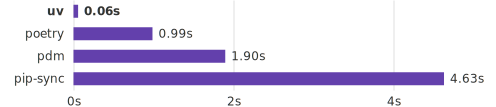

# UV

[UV](https://docs.astral.sh/uv/) is a modern, high-performance Python package manager and installer written in Rust.

<p align="center">
  
</p>

Key features that make UV stand out:

* Lightning-fast package installation and dependency resolution
* Compatible with existing Python tools and workflows
* Built-in virtual environment management
* Support for modern packaging standards
* Reliable dependency locking and reproducible environments
* Memory-efficient operation, especially for large projects

## Install

> [!NOTE]
> **brew** also install `zsh completions` when you run below command

```shell
brew install uv
```

Add `UV_TOOL_BIN_DIR` to paths

> [!NOTE]
> We automatically add it to path, if you use our **dotfiles**, See [extra.zsh](../../../dotfiles/my/extra.zsh)

```shell
export PATH="$HOME/.local/bin:$PATH"
```

## Usage

### Initializing a new project

> [!NOTE]
> For lib projects use: `uv init --lib`

```shell
uv init explore-uv
cd explore-uv
uv sync         # create lockfiles, install Python deps
```

Git is automatically initialized and main git-related files like `.gitignore` and an empty `README.md` are generated.

### Dependency Management With UV

#### Adding initial dependencies to the project

UV combines the environment creation and dependency installation into a single command. UV also updates the `pyproject.toml` and `uv.lock` files after each add command.

```shell
# Installing the latest version of a package:
uv add pydantic
# Installing a specific version:
uv add requests=2.1.2
# Change the bounds of a package's constraints:
uv add 'requests<3.0.0'
# Make a dependency platform-specific:
uv add 'requests; sys_platform="linux"'
```

The first time you run the add command, UV creates a new virtual environment in the current working directory and installs the specified dependencies. On subsequent runs, UV will reuse the existing virtual environment and only install or update the newly requested packages, ensuring efficient dependency management.

> [!TIP]
> You can also just edit these dependencies manually (this is what I usually do), and just run `uv sync` whenever you do, to update your `uv.lock` (you shouldn’t edit these manually) and your `venv`.

To remove a dependency from the environment and the `pyproject.toml` file, you can use the `uv remove` command. It will uninstall the package and all its child-dependencies:

```shell
uv remove pydantic
```

#### Adding optional dependencies

Optional dependencies are packages that are not required for the core functionality of your project but may be needed for specific features. For example, Pandas has an `excel` extra and a `plot` extra to avoid the installation of Excel parsers and matplotlib unless someone explicitly requires them.

With UV, this syntax is slightly different. First, ensure that the core Pandas package is installed:

```shell
uv add pandas
```

Then, add its optional dependencies:

```shell
uv add pandas --optional plot excel
```

#### Dependency groups

Dependency groups allow you to organize your dependencies into logical groups, such as development dependencies, test dependencies, or documentation dependencies. This is useful for keeping your production dependencies separate from your development dependencies.

To add a dependency to a specific group, use the `--group` flag:

```shell
uv add --group group_name package_name
```

#### Managing Tools: Global vs. Project-Specific

**uv** makes it easy to install CLI tools

##### Installing Global Tools

```shell
uv tool install black
```

This makes **black** available across all your projects but keeps it in its isolated virtual environment, avoiding system-wide conflicts.

##### Project-Specific Tools

If you need a tool for a specific project, add it directly as a dependency:

```shell
uv add --group dev ruff
```

This keeps the tool local to your project and listed in your `pyproject.toml`.
Your other projects remain unaffected, allowing for isolated development environments.

### Running Python scripts with UV

Once you install the necessary dependencies, you can start working on your Python scripts as usual. UV provides a few different ways to run Python code:

```shell
uv run hello.py
```

The run command ensures that the script is executed inside the virtual environment UV created for the project.

#### Environment variables

`uv run` can load [environment variables](https://docs.astral.sh/uv/configuration/files/#env) from dotenv files (e.g., `.env`, `.env.local`, `.env.development`), powered by the [dotenvy](https://github.com/allan2/dotenvy) crate.  
To load a `.env` file from a dedicated location, set the `UV_ENV_FILE` environment variable, or pass the `--env-file` flag to `uv run`.

The `--env-file` flag can be provided multiple times, with subsequent files overriding values defined in previous files.

### Changing Python versions for the current project

You can switch Python versions for your current UV project at any point as long as the new version satisfies the specifications in your pyproject.toml file.

For example, the following file requires Python versions 3.9 and above:

```toml
requires-python = ">=3.9"
```

### What Are UV Tools And How to Use Them?

Some Python packages are exposed as command-line tools like `ruff` or `black` for code formatting and linting, `pytest` for testing, `pyright` for type checking, etc. UV provides two special interfaces to manage these packages:

UV provides two special interfaces to manage these packages:

1. Using `uv tool run`:

    ```shell
    uv tool run black hello.py
    ```

2. Running Tools Ephemerally with `uvx` command:

    ```shell
    uvx black hello.py
    ```

Read the [UV Tools section of the documentation](https://docs.astral.sh/uv/concepts/tools/) to learn more about these interfaces.

#### Linting

Let’s also add [Ruff](https://docs.astral.sh/ruff/):

```shell
uv add --dev ruff
```

```shell
uv run ruff format        # format (what black used to do)
uv run ruff check --fix    # lint   (what flake8 used to do)
```

#### Typing

first install it

```shell
uv add --dev pyright
```

[configure](https://github.com/microsoft/pyright/blob/main/docs/configuration.md) it

```toml
[tool.pyright]
venvPath = "."          # uv installs the venv in the current dir
venv = ".venv"          #       in a folder called `.venv`
strict = ["**/*.py"]    # use 'strict' checking on all files
pythonVersion = "3.12"  # if library, specify the _lowest_ you support
```

And now you can run it with `uv run pyright`. And, as with the formatters/linters, you should get it integrated with your editor.

#### Testing

```shell
uv add --dev pytest
```

Sample test

```python
# tests/test_nothing.py
from explore-uv.hello import main
def test_hello():
    main("what?")  # main doesn't accept any args 😉
```

And then:

```shell
uv run pytest

...
FAILED tests/test_import.py::test_hello -
TypeError: main() takes 0 positional arguments but 1 was given
```

I’ll leave fixing the test as an exercise for the reader.

#### Task runner

Let’s install it with  `uv add --dev poethepoet` and set it up right at the top of the `pyproject.toml`

```toml
[tool.poe.tasks]
# run with eg `uv run poe fmt`
fmt = "ruff format"
lint = "ruff check --fix"
check = "pyright"
test = "pytest"
# run all the above
all = [ {ref="fmt"}, {ref="lint"}, {ref="check"}, {ref="test"} ]
```

Then any time you’ve made some changes or are preparing to commit, you can run `uv run poe test` or just run `uv run poe all` and the full suite of tools will get to work for you!

You can always still run `uv run ruff format` or whatever

### Switching From PIP and Virtualenv to UV

1. Converting an existing `virtualenv` project

    start by generating a requirements.txt file from your current environment if you haven't already:

    ```shell
    pip freeze > requirements.txt
    ```

    Then, create a new UV project in the same directory:

    ```shell
    uv init .
    ```

    Finally, install the dependencies from your requirements file:

    ```shell
    uv pip install -r requirements.txt
    ```

2. Replacing common pip/virtualenv commands

    | pip/virtualenv command          | UV equivalent                      |
    |---------------------------------|------------------------------------|
    | python -m venv .venv            | uv venv                            |
    | pip install package             | uv add package                     |
    | pip install -r requirements.txt | uv pip install -r requirements.txt |
    | pip uninstall package           | uv remove package                  |
    | pip freeze                      | uv pip freeze                      |
    | pip list                        | uv pip list                        |

### Monorepo

This is the bonus section!
If you’re building something in a big team, and you don’t have a monolith, you’re likely to have multiple apps and libraries intermingling.

The best place to start is to have a glance at the uv [Workspace docs](https://docs.astral.sh/uv/concepts/projects/workspaces/). Then I recommend checking out the example python monorepos: [uv-monorepo](https://github.com/JasperHG90/uv-monorepo), [postmodern-mono](https://github.com/carderne/postmodern-mono)

#### Structure

There are three packages split into libs and apps:

* **libs**: importable packages, never run independently, do not have entry points
* **apps**: have entry points, never imported

> Note that neither of these definitions are enforced by anything in `Python` or `uv`.
>
```shell
.
├── pyproject.toml              # root pyproject
├── uv.lock
├── libs
│   └── greeter
│       ├── pyproject.toml      # package dependencies here
│       └── agentic          # all packages are namespaced
│           └── greeter
│               └── __init__.py
└── apps
    ├── server
    │   ├── pyproject.toml      # this one depends on libs/greeter
    │   ├── Dockerfile          # and it gets a Dockerfile
    │   └── agentic
    │       └── server
    │           └── __init__.py
    └── mycli
        ├── pyproject.toml      # this one has a cli entrypoint
        └── agentic
            └── mycli
                └── __init__.py
```

In a workspace, each package defines its own `pyproject.toml`, but the workspace shares a single lockfile, ensuring that the workspace operates with a consistent set of dependencies.

#### Getting started

To create a workspace, add a `tool.uv.workspace` table to a `pyproject.toml`, which will implicitly create a workspace rooted at that package.

> [!TIP]
> By default, running `uv init` inside an existing package will add the newly created member to the workspace, creating a `tool.uv.workspace` table in the workspace root if it doesn't already exist.
>

Setup apps/libs projects in monorepo

```shell
cd apps
uv init --app server --description 'agents server'
uv init --app cli --description 'cli app'
cd ../libs
uv init --lib utils  --description 'Utility functions'
```

run from root when using `--package` option

```shell
# run format with ruff
uv run --package server ruff format
# or format via poe
uv run --package server poe fmt
# add dependency to individual package
uv add --package cli typer
# run individual package script
uv run --package cli ai_agents_cli
```

> Dependencies between workspace members are editable.

## Commands

### Managing Python Versions in UV

```shell
uv python install # Install Python versions.
uv python list # View available Python versions.
uv python list --only-installed # Listing existing Python versions
uv python find # Find an installed Python version.
uv python pin # Pin the current project to use a specific Python version.
uv python uninstall # Uninstall a Python version.
```

To learn more about [managing Python versions with UV](https://docs.astral.sh/uv/concepts/python-versions/), refer to the documentation.

### Miscellaneous

```shell
# To generate a requirements.txt from a UV lock file, use the following command:
uv export -o requirements.txt
```

### Utility

```shell
# self update
uv self update
# clear cache
uv cache clean
# Remove outdated cache entries
uv cache prune
```

## References

* How to Learn Python From Scratch in 2025: [An Expert Guide](https://www.datacamp.com/blog/how-to-learn-python-expert-guide)
* UV [features](https://github.com/astral-sh/uv/blob/main/docs/getting-started/features.md)
* UV [Working on projects](https://docs.astral.sh/uv/guides/projects/)
* Beyond Hypermodern: [Python is easy now](https://rdrn.me/postmodern-python/)
* Python UV: [The Ultimate Guide to the Fastest Python Package Manager](https://www.datacamp.com/tutorial/python-uv)
* [Writing your pyproject.toml](https://packaging.python.org/en/latest/guides/writing-pyproject-toml/)
* Mastering Python Project Management with uv: Part 2 — [Deep Dives and Advanced Use](https://bury-thomas.medium.com/mastering-python-project-management-with-uv-part-2-deep-dives-and-advanced-use-1e2540e6f4a6)
